# Azure Data Factory Agent

An AI-powered assistant for Azure Data Factory operations with dual UI implementations (Streamlit and Gradio) and comprehensive MCP (Model Context Protocol) integration.

## 🚀 Quick Start

The Azure Data Factory Agent provides two interface options:

### Streamlit Interface (Professional Dashboard)
```bash
python stadf.py
# Access at http://localhost:8501
```

### Gradio Interface (Modern Chat)
```bash
python gradf.py
# Access at http://localhost:7860
```

## 🏗️ Architecture Overview

```mermaid
graph TB
    User[👤 User] --> UI{UI Choice}
    UI --> |Professional| ST[📊 Streamlit<br/>stadf.py]
    UI --> |Chat-focused| GR[💬 Gradio<br/>gradf.py]
    ST --> Core[🧠 adf_agent Function]
    GR --> Core
    Core --> Azure[☁️ Azure AI Projects]
    Core --> MCP[🔧 MCP Server]
    Azure --> OpenAI[🤖 Azure OpenAI]
    MCP --> Tools[🛠️ MCP Tools]
    Tools --> ADF[🏭 Azure Data Factory]
```



## ✨ Key Features

- **🤖 AI-Powered Assistance**: Leverages Azure OpenAI for intelligent responses
- **🔧 MCP Integration**: Extensible tool functionality via Model Context Protocol
- **🎨 Dual UI Options**: Choose between Streamlit (professional) or Gradio (modern chat)
- **☁️ Native Azure Integration**: Seamless integration with Azure AI Projects and Data Factory
- **📊 Rich Debugging**: Comprehensive logging and execution tracking
- **🔒 Enterprise Security**: Azure AD authentication and RBAC support

## 📚 Comprehensive Documentation

| Document | Description |
|----------|-------------|
| **[📖 Documentation Home](./docs/README.md)** | Complete documentation overview and navigation |
| **[🏗️ Architecture](./docs/architecture.md)** | System architecture, components, and MCP integration |
| **[📋 Business Requirements](./docs/business-requirements.md)** | Detailed use cases, user stories, and success metrics |
| **[📊 Streamlit Implementation](./docs/streamlit-implementation.md)** | Professional dashboard interface documentation |
| **[💬 Gradio Implementation](./docs/gradio-implementation.md)** | Modern chat interface documentation |
| **[🔄 User Flows](./docs/user-flows.md)** | User interaction flows and journey diagrams |
| **[🔧 MCP Integration](./docs/mcp-integration.md)** | Model Context Protocol integration guide |
| **[🚀 Deployment Guide](./docs/deployment.md)** | Setup, configuration, and deployment instructions |

## 🛠️ Prerequisites

- Azure subscription with AI Projects enabled
- Azure OpenAI service deployment (GPT-4o-mini recommended)
- Python 3.8+ environment
- Access to Azure Data Factory instances

## ⚡ Installation

1. **Clone the repository**
   ```bash
   git clone https://github.com/balakreshnan/deloitte-fy25hack.git
   cd deloitte-fy25hack
   ```

2. **Install dependencies**
   ```bash
   pip install -r requirements.txt
   ```

3. **Configure environment**
   ```bash
   cp .env.example .env
   # Edit .env with your Azure credentials
   ```

4. **Run the application**
   ```bash
   # Streamlit interface
   streamlit run stadf.py
   
   # OR Gradio interface
   python gradf.py
   ```

## 🔧 Environment Configuration

Create a `.env` file with the following variables:

```bash
# Azure AI Projects
PROJECT_ENDPOINT=https://your-account.services.ai.azure.com/api/projects/project-name
MODEL_ENDPOINT=https://your-account.services.ai.azure.com
MODEL_API_KEY=your-azure-openai-api-key
MODEL_DEPLOYMENT_NAME=gpt-4o-mini

# MCP Server (optional)
MCP_SERVER_URL=https://learn.microsoft.com/api/mcp
MCP_SERVER_LABEL=MicrosoftLearn

# Azure Authentication (optional)
AZURE_TENANT_ID=your-tenant-id
AZURE_CLIENT_ID=your-client-id
AZURE_CLIENT_SECRET=your-client-secret
```

## 🎯 Usage Examples

### Ask about Pipeline Status
```
"What pipelines are currently running?"
"Show me the status of the customer data pipeline"
"Why did my ETL job fail last night?"
```

### Get Operational Insights
```
"Give me a summary of yesterday's pipeline executions"
"Which pipelines have the highest failure rate?"
"Show me performance metrics for the sales pipeline"
```

### Troubleshooting Support
```
"Help me diagnose the failed invoice processing pipeline"
"What's causing the data warehouse refresh to timeout?"
"Show me error logs for pipeline run ID 12345"
```

## 📊 Interface Comparison

| Feature | Streamlit | Gradio |
|---------|-----------|--------|
| **Style** | Professional Dashboard | Modern Chat Interface |
| **Best For** | Business Users, Analysts | Developers, Quick Queries |
| **Layout** | Two-panel split view | Conversational flow |
| **Debugging** | Structured panels | Rich HTML tables |
| **Mobile** | Responsive design | Touch-optimized |

## 🔒 Security & Compliance

- **Authentication**: Azure AD integration with DefaultAzureCredential
- **Authorization**: Respects existing Azure RBAC permissions
- **Data Privacy**: No persistent storage of sensitive pipeline data
- **Encryption**: TLS/SSL for all communications
- **Audit Logging**: Comprehensive logging for security monitoring

## 🚀 Deployment Options

- **🏠 Local Development**: Run directly with Python
- **🐳 Docker**: Containerized deployment with Docker/Docker Compose
- **☁️ Azure Container Apps**: Serverless container deployment
- **🌐 Azure Web Apps**: Platform-as-a-service deployment
- **⚓ Kubernetes**: Orchestrated container deployment

See the [Deployment Guide](./docs/deployment.md) for detailed instructions.

## 🤝 Contributing

We welcome contributions! Please see our [Contributing Guidelines](./CONTRIBUTING.md) for details.

## 📄 License

This project is licensed under the MIT License - see the [LICENSE](./LICENSE) file for details.

## 🆘 Support

For support and questions:

1. **📚 Check the Documentation**: Start with our comprehensive [documentation](./docs/README.md)
2. **🐛 Report Issues**: Use the [GitHub Issues](https://github.com/balakreshnan/deloitte-fy25hack/issues) page
3. **💬 Ask Questions**: Create a [Discussion](https://github.com/balakreshnan/deloitte-fy25hack/discussions)

## 🙏 Acknowledgments

- **Azure AI Team** for the Azure AI Projects and Agents framework
- **Microsoft Learn** for MCP server integration
- **Streamlit & Gradio Teams** for excellent UI frameworks
- **Deloitte FY25 Hackathon** participants and organizers

---

**Deloitte FY 25 Hackathon Project** | Built with ❤️ for Azure Data Factory operations
