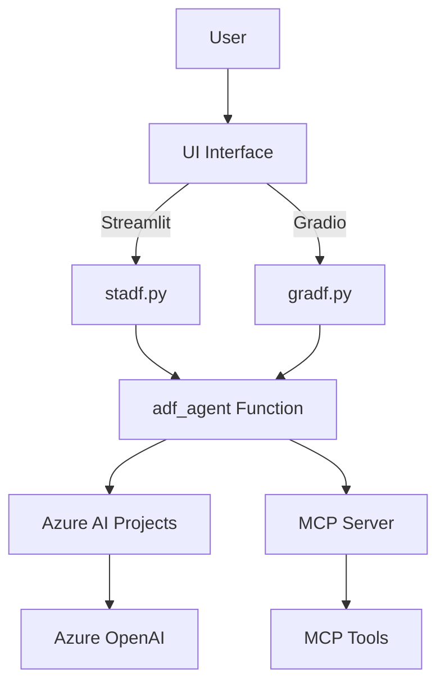

# Azure Data Factory Agent Documentation

Welcome to the comprehensive documentation for the Azure Data Factory (ADF) Agent application.

## 📑 Documentation Overview

This project provides an AI-powered assistant for Azure Data Factory operations through two different user interface implementations, both integrated with Microsoft's Model Context Protocol (MCP).

### 📚 Documentation Structure

| Document | Description |
|----------|-------------|
| [Architecture Overview](./architecture.md) | System architecture, components, and MCP integration |
| [Business Requirements](./business-requirements.md) | Detailed business requirements, use cases, and user stories |
| [Streamlit Implementation](./streamlit-implementation.md) | Complete documentation for the Streamlit-based UI |
| [Gradio Implementation](./gradio-implementation.md) | Complete documentation for the Gradio-based UI |
| [User Interaction Flows](./user-flows.md) | User journey flows and interaction diagrams |
| [MCP Integration Guide](./mcp-integration.md) | Model Context Protocol integration details |
| [Deployment Guide](./deployment.md) | Setup, configuration, and deployment instructions |

## 🚀 Quick Start

The Azure Data Factory Agent provides two UI options:

1. **Streamlit Interface** (`stadf.py`) - Professional dashboard-style interface
2. **Gradio Interface** (`gradf.py`) - Modern chat-based interface

Both interfaces provide:
- Real-time Azure Data Factory job status inquiries
- AI-powered responses using Azure OpenAI
- MCP tool integration for enhanced capabilities
- Detailed conversation history and debugging information

## 🔧 Key Features

- **AI-Powered Assistance**: Leverages Azure OpenAI models for intelligent responses
- **MCP Integration**: Uses Model Context Protocol for extensible tool functionality
- **Dual UI Options**: Choose between Streamlit or Gradio interfaces
- **Azure Integration**: Native integration with Azure AI Projects and Azure Data Factory
- **Rich Debugging**: Comprehensive logging and step-by-step execution tracking

## 🏗️ Architecture Highlights

## 📋 Prerequisites

- Azure subscription with AI Projects enabled
- Azure OpenAI service deployment
- Python 3.8+ environment
- Required dependencies (see requirements.txt)

For detailed setup instructions, see the [Deployment Guide](./deployment.md).