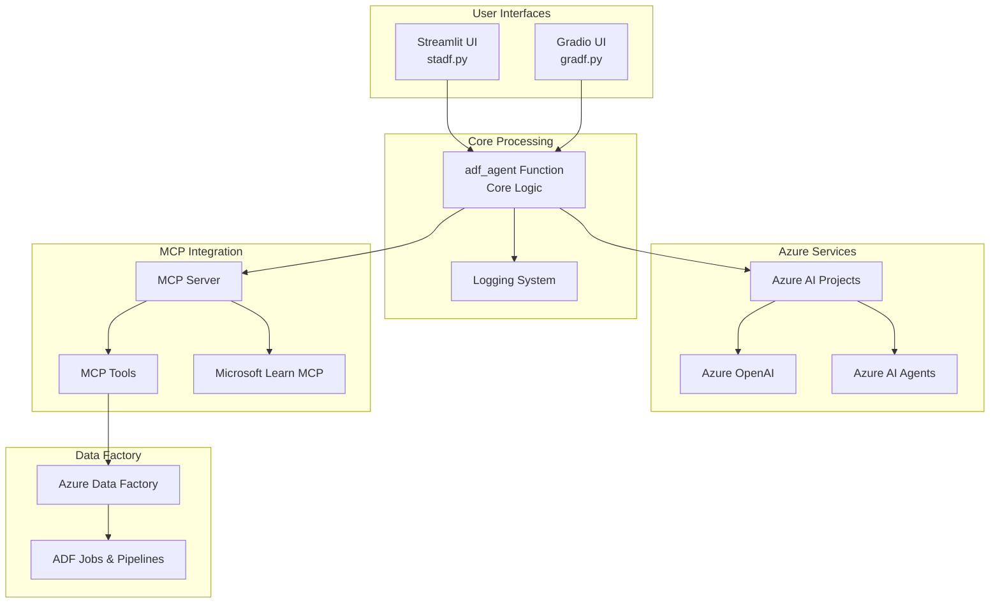
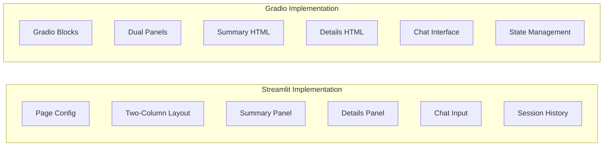
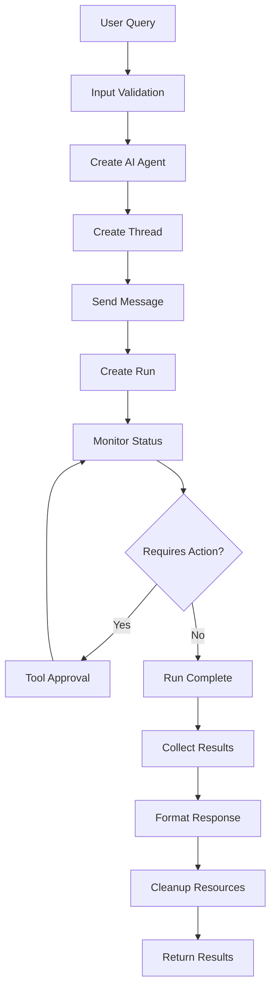
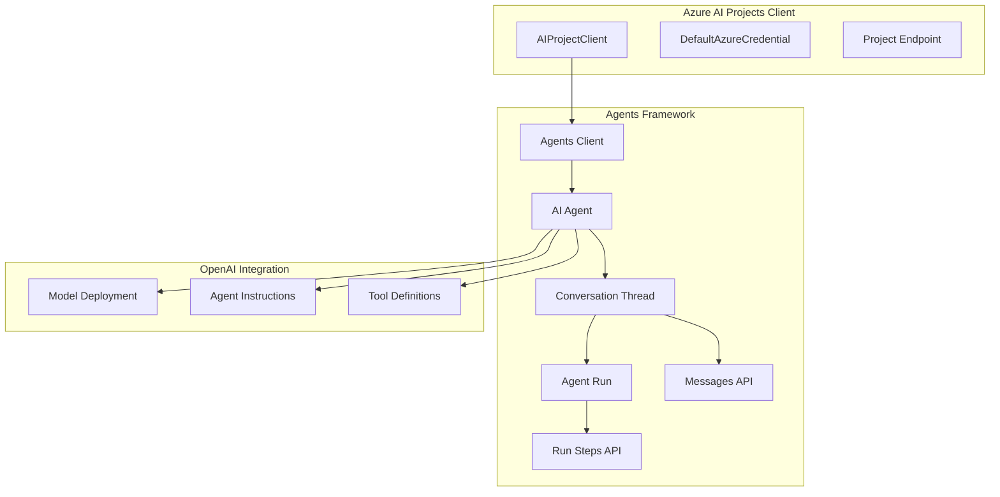
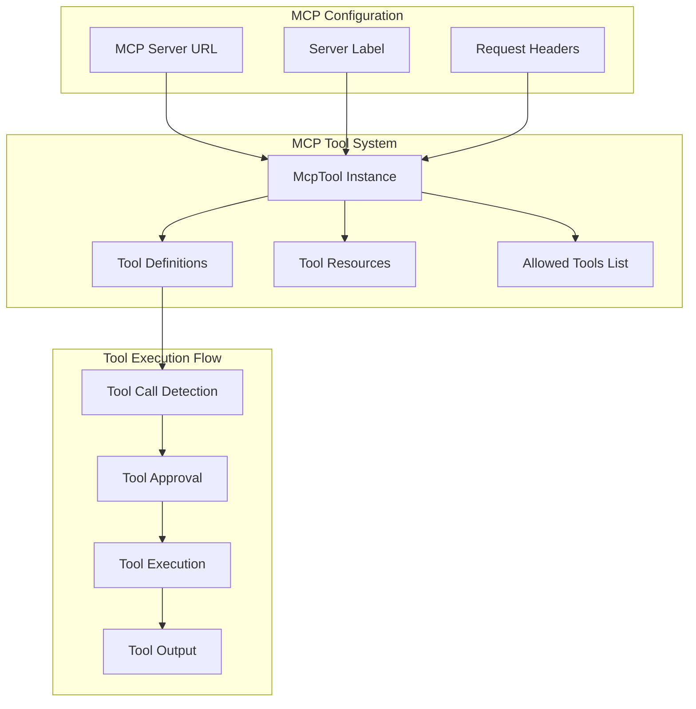
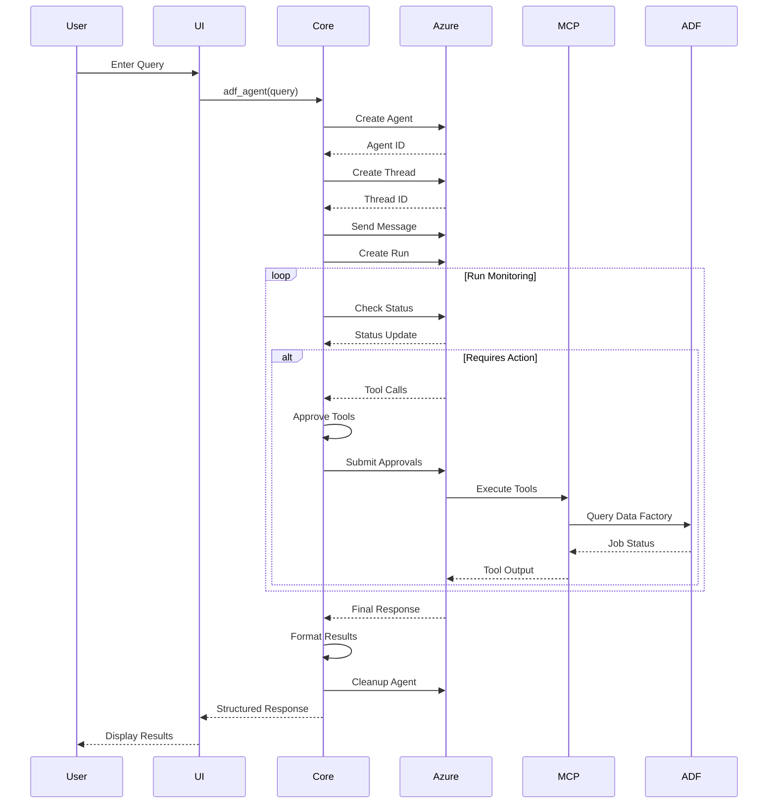
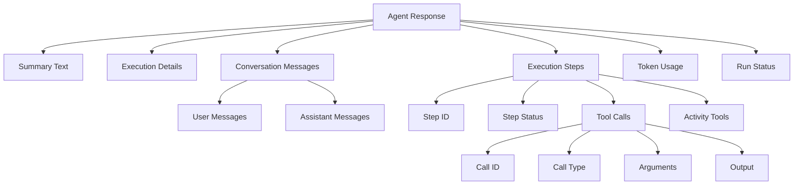
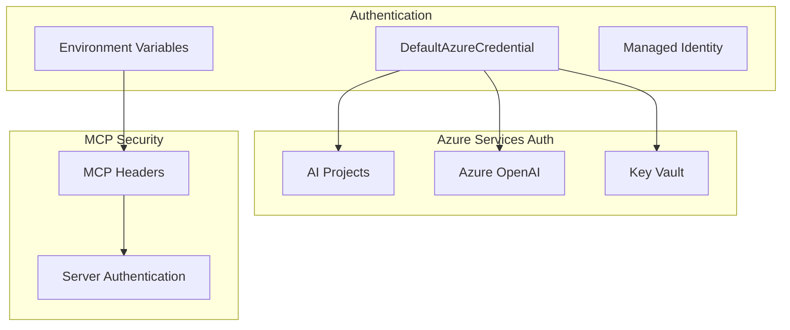
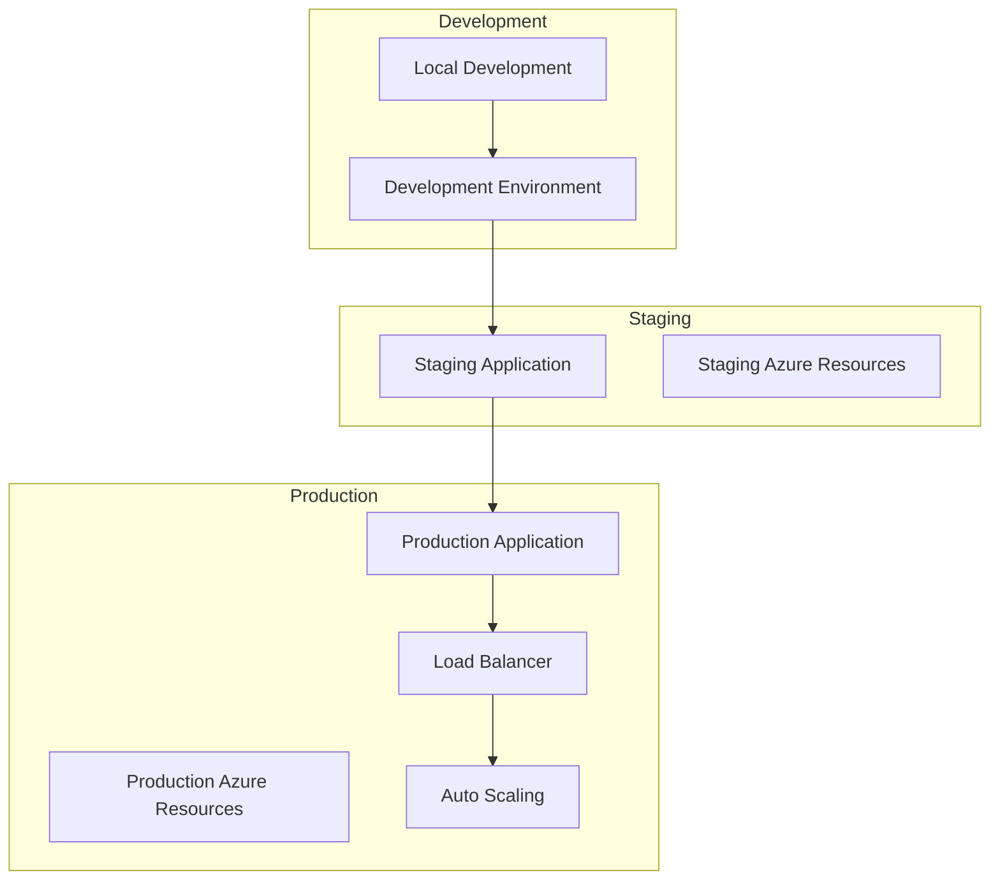

# Architecture Overview

## System Architecture

The Azure Data Factory Agent is built on a modular, cloud-native architecture that integrates Azure AI services with Model Context Protocol (MCP) for extensible AI-powered assistance.

## High-Level Architecture

## Component Architecture

### 1. User Interface Layer

**Streamlit Features:**
- Fixed-position chat input
- Real-time scrollable panels
- Session state management
- Professional dashboard styling

**Gradio Features:**
- Modern chat interface
- HTML-rendered panels
- State persistence
- Responsive design

### 2. Core Processing Layer

**Core Functions:**
- **adf_agent()**: Main orchestration function
- **Input Processing**: Query validation and preparation
- **Agent Management**: Dynamic agent creation and cleanup
- **Tool Integration**: MCP tool approval and execution
- **Response Formatting**: Structured result preparation

### 3. Azure AI Integration

### 4. MCP Integration Architecture

## Data Flow Architecture

### Request Processing Flow

### Response Data Structure

## Security Architecture

### Authentication & Authorization

### Environment Configuration

| Variable | Purpose | Example |
|----------|---------|---------|
| `PROJECT_ENDPOINT` | Azure AI Projects endpoint | `https://account.services.ai.azure.com/api/projects/project-name` |
| `MODEL_ENDPOINT` | Azure OpenAI endpoint | `https://account.services.ai.azure.com` |
| `MODEL_API_KEY` | Azure OpenAI API key | Secure key from Azure |
| `MODEL_DEPLOYMENT_NAME` | Model deployment name | `gpt-4o-mini` |
| `MCP_SERVER_URL` | MCP server URL | `https://learn.microsoft.com/api/mcp` |
| `MCP_SERVER_LABEL` | MCP server label | `MicrosoftLearn` |

## Scalability Considerations

### Performance Optimizations

1. **Agent Lifecycle Management**
   - Dynamic agent creation and cleanup
   - Resource management for concurrent requests
   - Connection pooling for Azure services

2. **MCP Tool Caching**
   - Tool definition caching
   - Response caching for common queries
   - Connection reuse for MCP servers

3. **UI Responsiveness**
   - Async processing patterns
   - Progressive response display
   - Efficient state management

### Deployment Patterns

This architecture provides a robust, scalable foundation for AI-powered Azure Data Factory assistance with dual UI implementations and comprehensive MCP integration.