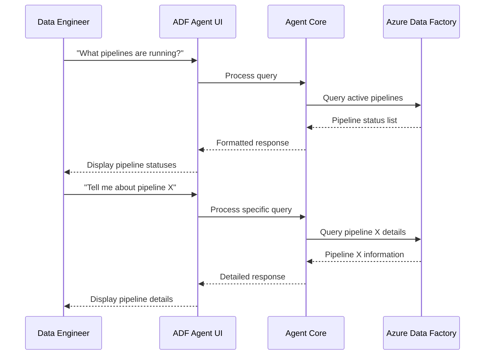
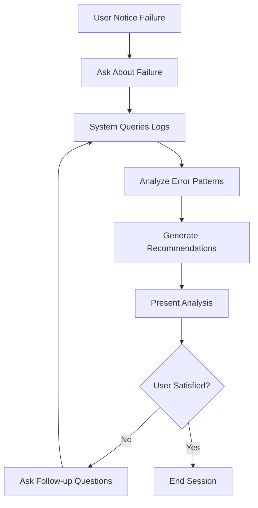

# Business Requirements & Use Cases

## Executive Summary

The Azure Data Factory Agent is an AI-powered solution designed to provide intelligent assistance for Azure Data Factory operations. It addresses the need for streamlined monitoring, troubleshooting, and management of data pipelines through natural language interactions.

## Business Requirements

### Primary Business Objectives

1. **Operational Efficiency**
   - Reduce time spent on routine Data Factory monitoring tasks
   - Minimize manual navigation through Azure portal interfaces
   - Enable rapid troubleshooting of pipeline issues

2. **Accessibility & Usability**
   - Provide natural language interface for technical and non-technical users
   - Support multiple UI frameworks to meet diverse user preferences
   - Enable self-service capabilities for data pipeline monitoring

3. **Integration & Extensibility**
   - Seamless integration with existing Azure infrastructure
   - Extensible architecture supporting future tool additions
   - Consistent experience across different interface implementations

### Functional Requirements

#### FR-1: Natural Language Query Processing
- **Requirement**: Users must be able to ask questions about Azure Data Factory in natural language
- **Acceptance Criteria**:
  - Support queries like "What is the status of my latest pipeline run?"
  - Process complex questions about specific jobs, schedules, and errors
  - Provide contextual follow-up responses

#### FR-2: Dual Interface Support
- **Requirement**: Provide both Streamlit and Gradio interface options
- **Acceptance Criteria**:
  - Identical core functionality across both interfaces
  - Interface-specific optimizations for user experience
  - Consistent branding and styling

#### FR-3: Real-time Data Factory Integration
- **Requirement**: Access real-time Azure Data Factory information
- **Acceptance Criteria**:
  - Connect to Azure Data Factory APIs
  - Retrieve current job statuses, pipeline information
  - Provide up-to-date operational insights

#### FR-4: MCP Tool Integration
- **Requirement**: Leverage Model Context Protocol for extensible functionality
- **Acceptance Criteria**:
  - Support dynamic tool discovery and execution
  - Enable tool approval workflows
  - Provide detailed tool execution logging

#### FR-5: Conversation History & Context
- **Requirement**: Maintain conversation context and history
- **Acceptance Criteria**:
  - Store session-based conversation history
  - Support multi-turn conversations
  - Provide conversation clearing functionality

### Non-Functional Requirements

#### NFR-1: Performance
- **Response Time**: Initial response within 5 seconds for simple queries
- **Scalability**: Support 10+ concurrent users per deployment
- **Availability**: 99.9% uptime during business hours

#### NFR-2: Security
- **Authentication**: Use Azure AD authentication mechanisms
- **Authorization**: Respect existing Azure RBAC permissions
- **Data Privacy**: No storage of sensitive pipeline data

#### NFR-3: Usability
- **Learning Curve**: Minimal training required for basic operations
- **Accessibility**: Support standard web accessibility guidelines
- **Mobile Friendly**: Responsive design for tablet/mobile access

## Use Cases

### UC-1: Pipeline Status Monitoring

**Actor**: Data Engineer
**Goal**: Check the status of currently running data pipelines
**Preconditions**: User has access to Azure Data Factory
**Flow**:
1. User opens the application interface
2. User asks "What pipelines are currently running?"
3. System queries Azure Data Factory APIs
4. System provides list of active pipelines with status
5. User can ask follow-up questions about specific pipelines

**Success Criteria**: User receives accurate, real-time pipeline status information

### UC-2: Troubleshooting Failed Jobs

**Actor**: Data Analyst
**Goal**: Investigate and understand pipeline failures
**Preconditions**: User has appropriate Azure permissions
**Flow**:
1. User notices a failed pipeline notification
2. User asks "Why did the customer data pipeline fail?"
3. System retrieves error logs and execution details
4. System provides failure analysis with recommendations
5. User gets actionable insights for resolution

**Success Criteria**: User receives comprehensive failure analysis with actionable recommendations

### UC-3: Operational Reporting

**Actor**: Operations Manager
**Goal**: Get daily operational summary of Data Factory activities
**Preconditions**: User has reporting access permissions
**Flow**:
1. User requests daily summary report
2. System aggregates pipeline execution data
3. System provides metrics on success rates, execution times
4. User reviews operational health indicators
5. User can drill down into specific areas of concern

**Success Criteria**: User receives comprehensive operational dashboard

### UC-4: Schedule and Configuration Inquiries

**Actor**: DevOps Engineer
**Goal**: Understand pipeline schedules and configurations
**Preconditions**: User has configuration access
**Flow**:
1. User asks about pipeline scheduling
2. System retrieves schedule configurations
3. System explains current settings and next run times
4. User can modify schedules through recommendations
5. System confirms changes and updates

**Success Criteria**: User has clear understanding of scheduling and can make informed changes

## User Stories

### Epic: Pipeline Monitoring

**US-1**: As a data engineer, I want to check pipeline status so I can ensure data processes are running correctly.
- Acceptance Criteria: Can query current pipeline statuses in natural language
- Story Points: 5

**US-2**: As a data analyst, I want to understand pipeline execution history so I can identify patterns and issues.
- Acceptance Criteria: Can retrieve historical execution data with trends
- Story Points: 8

**US-3**: As an operations manager, I want real-time alerts about pipeline failures so I can respond quickly to issues.
- Acceptance Criteria: Receive immediate notification of critical failures
- Story Points: 13

### Epic: Troubleshooting & Diagnostics

**US-4**: As a data engineer, I want detailed error analysis when pipelines fail so I can quickly resolve issues.
- Acceptance Criteria: Comprehensive error details with resolution suggestions
- Story Points: 13

**US-5**: As a DevOps engineer, I want to trace data lineage through failed pipelines so I can understand impact scope.
- Acceptance Criteria: Visual representation of affected data dependencies
- Story Points: 21

### Epic: Configuration Management

**US-6**: As a data architect, I want to review pipeline configurations so I can ensure compliance with standards.
- Acceptance Criteria: Access to configuration details and compliance checking
- Story Points: 8

**US-7**: As a DevOps engineer, I want to compare pipeline configurations across environments so I can ensure consistency.
- Acceptance Criteria: Side-by-side configuration comparison functionality
- Story Points: 13

## Success Metrics

### Primary KPIs

1. **User Adoption**
   - Target: 80% of Data Factory users adopt the tool within 3 months
   - Measure: Active user sessions per month

2. **Query Resolution Rate**
   - Target: 85% of queries resolved without escalation
   - Measure: Successful query completion rate

3. **Time Savings**
   - Target: 40% reduction in time spent on routine monitoring tasks
   - Measure: Before/after task completion time analysis

4. **User Satisfaction**
   - Target: 4.5/5 user satisfaction score
   - Measure: Regular user feedback surveys

### Operational Metrics

1. **System Performance**
   - Average response time < 5 seconds
   - 99.9% system availability
   - Zero data security incidents

2. **Integration Health**
   - 99% successful Azure API calls
   - 95% successful MCP tool executions
   - < 1% authentication failures

## Risk Assessment

### Technical Risks

| Risk | Impact | Probability | Mitigation |
|------|--------|-------------|-----------|
| Azure API rate limiting | High | Medium | Implement caching and request throttling |
| MCP server availability | Medium | Low | Fallback mechanisms and error handling |
| Model performance degradation | Medium | Medium | Regular model evaluation and updates |

### Business Risks

| Risk | Impact | Probability | Mitigation |
|------|--------|-------------|-----------|
| Low user adoption | High | Medium | Comprehensive training and change management |
| Competing internal tools | Medium | Low | Clear value proposition and integration strategy |
| Budget constraints | Medium | Low | Phased implementation approach |

## Compliance & Governance

### Data Governance
- All data access follows existing Azure RBAC policies
- No persistent storage of sensitive pipeline data
- Audit logging for all user interactions

### Security Compliance
- Integration with Azure AD for authentication
- Encryption in transit for all communications
- Regular security assessments and updates

### Regulatory Compliance
- GDPR compliance for EU users
- Industry-specific regulations (HIPAA, SOX) as applicable
- Data residency requirements respected

This comprehensive business requirements document serves as the foundation for the Azure Data Factory Agent implementation, ensuring alignment with organizational goals and user needs.