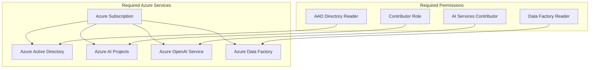
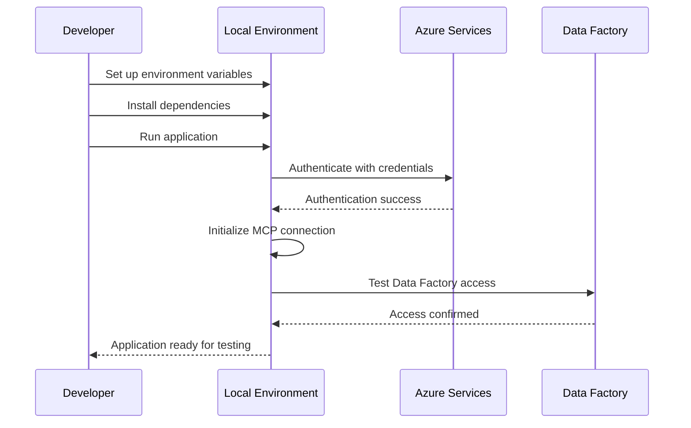
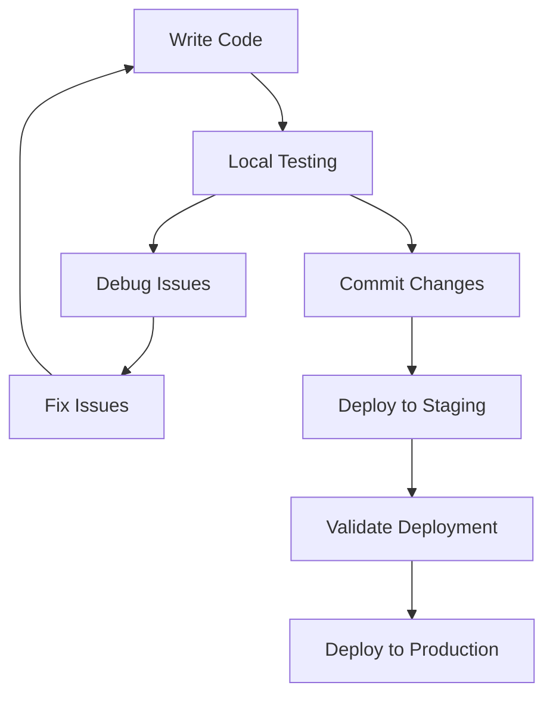
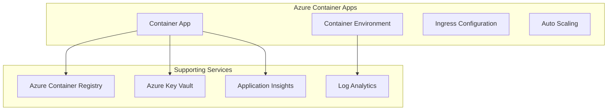
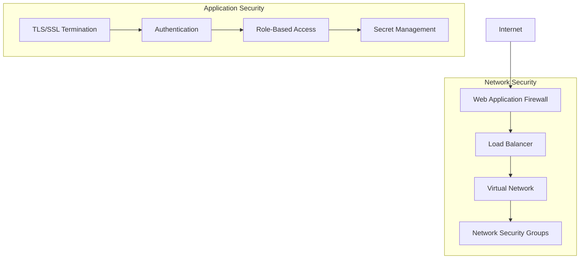
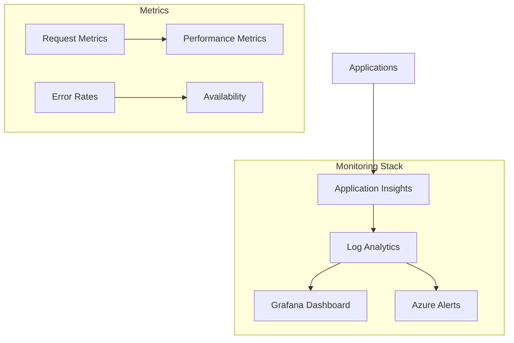
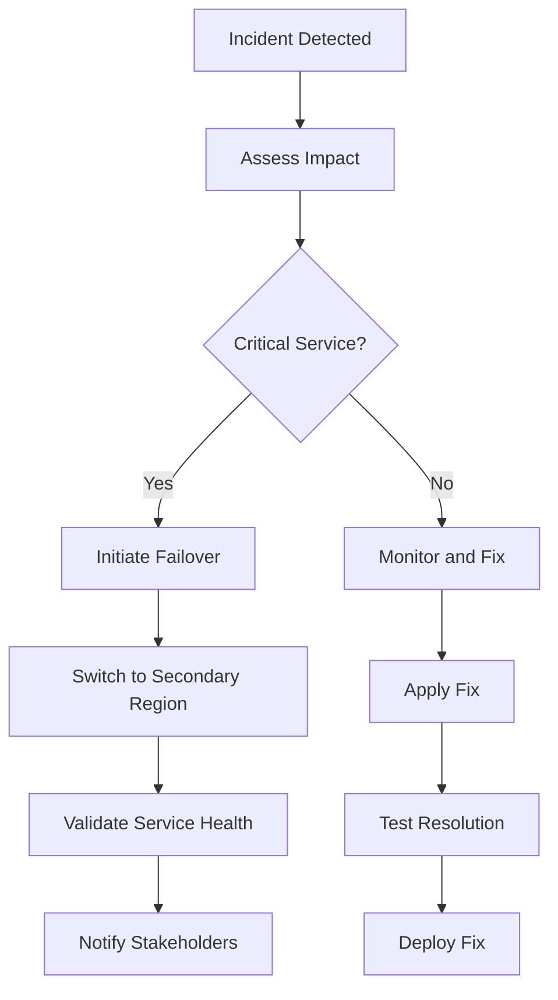

# Deployment Guide

## Overview

This deployment guide provides comprehensive instructions for setting up, configuring, and deploying the Azure Data Factory Agent in various environments. The guide covers both Streamlit and Gradio implementations with detailed configuration options.

## Prerequisites

### System Requirements

| Component | Minimum | Recommended |
|-----------|---------|-------------|
| Python | 3.8+ | 3.11+ |
| Memory | 2GB RAM | 4GB RAM |
| Storage | 1GB | 2GB |
| Network | Stable internet connection | High-speed broadband |

### Azure Prerequisites



### Service Setup Checklist

- [ ] Azure subscription with appropriate permissions
- [ ] Azure AI Projects workspace created
- [ ] Azure OpenAI service deployed with GPT model
- [ ] Azure Data Factory instance accessible
- [ ] Service principal or managed identity configured
- [ ] Network connectivity to all Azure services

## Environment Configuration

### 1. Environment Variables

Create a `.env` file in the project root:

```bash
# Azure AI Projects Configuration
PROJECT_ENDPOINT=https://your-account.services.ai.azure.com/api/projects/your-project-name
MODEL_ENDPOINT=https://your-account.services.ai.azure.com
MODEL_API_KEY=your-azure-openai-api-key
MODEL_DEPLOYMENT_NAME=gpt-4o-mini

# Azure OpenAI Configuration (Alternative)
AZURE_OPENAI_ENDPOINT=https://your-account.openai.azure.com
AZURE_OPENAI_KEY=your-azure-openai-key

# MCP Server Configuration
MCP_SERVER_URL=https://learn.microsoft.com/api/mcp
MCP_SERVER_LABEL=MicrosoftLearn

# Optional: Custom MCP Server
# MCP_SERVER_URL=https://your-custom-mcp-server.com/api/mcp
# MCP_SERVER_LABEL=CustomADFTools

# Azure Authentication (for service principal)
AZURE_TENANT_ID=your-tenant-id
AZURE_CLIENT_ID=your-client-id
AZURE_CLIENT_SECRET=your-client-secret

# Data Factory Configuration (optional)
ADF_SUBSCRIPTION_ID=your-subscription-id
ADF_RESOURCE_GROUP=your-resource-group
ADF_FACTORY_NAME=your-factory-name
```

### 2. Authentication Configuration

#### Option A: Managed Identity (Recommended for Azure deployment)

```python
# Automatically uses managed identity when deployed in Azure
from azure.identity import DefaultAzureCredential
credential = DefaultAzureCredential()
```

#### Option B: Service Principal

```python
# Uses service principal credentials from environment variables
from azure.identity import ClientSecretCredential

credential = ClientSecretCredential(
    tenant_id=os.environ["AZURE_TENANT_ID"],
    client_id=os.environ["AZURE_CLIENT_ID"],
    client_secret=os.environ["AZURE_CLIENT_SECRET"]
)
```

#### Option C: Interactive Authentication (Development only)

```python
# For local development with user authentication
from azure.identity import InteractiveBrowserCredential
credential = InteractiveBrowserCredential()
```

## Local Development Setup

### 1. Clone and Setup

```bash
# Clone repository
git clone https://github.com/balakreshnan/deloitte-fy25hack.git
cd deloitte-fy25hack

# Create virtual environment
python -m venv venv
source venv/bin/activate  # On Windows: venv\Scripts\activate

# Install dependencies
pip install -r requirements.txt

# Create environment file
cp .env.example .env
# Edit .env with your configuration
```

### 2. Local Testing



#### Test Streamlit Implementation

```bash
# Run Streamlit application
streamlit run stadf.py

# Access at http://localhost:8501
# Test with query: "What is the status of my data factory?"
```

#### Test Gradio Implementation

```bash
# Run Gradio application
python gradf.py

# Access at http://localhost:7860
# Test with query: "Show me recent pipeline runs"
```

### 3. Development Workflow



## Docker Deployment

### 1. Dockerfile for Streamlit

```dockerfile
FROM python:3.11-slim

WORKDIR /app

# Install system dependencies
RUN apt-get update && apt-get install -y \
    curl \
    && rm -rf /var/lib/apt/lists/*

# Copy requirements and install Python dependencies
COPY requirements.txt .
RUN pip install --no-cache-dir -r requirements.txt

# Copy application code
COPY stadf.py .
COPY .env .

# Expose port
EXPOSE 8501

# Health check
HEALTHCHECK --interval=30s --timeout=10s --start-period=30s --retries=3 \
    CMD curl -f http://localhost:8501/_stcore/health || exit 1

# Run application
CMD ["streamlit", "run", "stadf.py", "--server.address", "0.0.0.0", "--server.port", "8501"]
```

### 2. Dockerfile for Gradio

```dockerfile
FROM python:3.11-slim

WORKDIR /app

# Install system dependencies
RUN apt-get update && apt-get install -y \
    curl \
    && rm -rf /var/lib/apt/lists/*

# Copy requirements and install Python dependencies
COPY requirements.txt .
RUN pip install --no-cache-dir -r requirements.txt

# Copy application code
COPY gradf.py .
COPY stadf.py .
COPY .env .

# Expose port
EXPOSE 7860

# Health check
HEALTHCHECK --interval=30s --timeout=10s --start-period=30s --retries=3 \
    CMD curl -f http://localhost:7860/health || exit 1

# Run application
CMD ["python", "gradf.py"]
```

### 3. Docker Compose Setup

```yaml
version: '3.8'

services:
  adf-agent-streamlit:
    build:
      context: .
      dockerfile: Dockerfile.streamlit
    ports:
      - "8501:8501"
    environment:
      - PROJECT_ENDPOINT=${PROJECT_ENDPOINT}
      - MODEL_ENDPOINT=${MODEL_ENDPOINT}
      - MODEL_API_KEY=${MODEL_API_KEY}
      - MODEL_DEPLOYMENT_NAME=${MODEL_DEPLOYMENT_NAME}
      - MCP_SERVER_URL=${MCP_SERVER_URL}
      - MCP_SERVER_LABEL=${MCP_SERVER_LABEL}
    volumes:
      - .env:/app/.env
    restart: unless-stopped
    healthcheck:
      test: ["CMD", "curl", "-f", "http://localhost:8501/_stcore/health"]
      interval: 30s
      timeout: 10s
      retries: 3

  adf-agent-gradio:
    build:
      context: .
      dockerfile: Dockerfile.gradio
    ports:
      - "7860:7860"
    environment:
      - PROJECT_ENDPOINT=${PROJECT_ENDPOINT}
      - MODEL_ENDPOINT=${MODEL_ENDPOINT}
      - MODEL_API_KEY=${MODEL_API_KEY}
      - MODEL_DEPLOYMENT_NAME=${MODEL_DEPLOYMENT_NAME}
      - MCP_SERVER_URL=${MCP_SERVER_URL}
      - MCP_SERVER_LABEL=${MCP_SERVER_LABEL}
    volumes:
      - .env:/app/.env
    restart: unless-stopped
    healthcheck:
      test: ["CMD", "curl", "-f", "http://localhost:7860/health"]
      interval: 30s
      timeout: 10s
      retries: 3

  nginx:
    image: nginx:alpine
    ports:
      - "80:80"
      - "443:443"
    volumes:
      - ./nginx.conf:/etc/nginx/nginx.conf
      - ./ssl:/etc/nginx/ssl
    depends_on:
      - adf-agent-streamlit
      - adf-agent-gradio
    restart: unless-stopped
```

### 4. Build and Run

```bash
# Build and start services
docker-compose up -d

# View logs
docker-compose logs -f

# Scale services
docker-compose up -d --scale adf-agent-streamlit=2

# Stop services
docker-compose down
```

## Cloud Deployment Options

### 1. Azure Container Apps



#### Container Apps Deployment

```bash
# Create resource group
az group create --name adf-agent-rg --location eastus

# Create container environment
az containerapp env create \
  --name adf-agent-env \
  --resource-group adf-agent-rg \
  --location eastus

# Deploy Streamlit app
az containerapp create \
  --name adf-agent-streamlit \
  --resource-group adf-agent-rg \
  --environment adf-agent-env \
  --image youracr.azurecr.io/adf-agent-streamlit:latest \
  --target-port 8501 \
  --ingress external \
  --min-replicas 1 \
  --max-replicas 10 \
  --cpu 1.0 \
  --memory 2Gi \
  --env-vars PROJECT_ENDPOINT=secretref:project-endpoint

# Deploy Gradio app
az containerapp create \
  --name adf-agent-gradio \
  --resource-group adf-agent-rg \
  --environment adf-agent-env \
  --image youracr.azurecr.io/adf-agent-gradio:latest \
  --target-port 7860 \
  --ingress external \
  --min-replicas 1 \
  --max-replicas 10 \
  --cpu 1.0 \
  --memory 2Gi \
  --env-vars PROJECT_ENDPOINT=secretref:project-endpoint
```

### 2. Azure Web Apps

```bash
# Create App Service Plan
az appservice plan create \
  --name adf-agent-plan \
  --resource-group adf-agent-rg \
  --sku P1V2 \
  --is-linux

# Create Web App for Streamlit
az webapp create \
  --name adf-agent-streamlit \
  --resource-group adf-agent-rg \
  --plan adf-agent-plan \
  --deployment-container-image-name youracr.azurecr.io/adf-agent-streamlit:latest

# Configure app settings
az webapp config appsettings set \
  --name adf-agent-streamlit \
  --resource-group adf-agent-rg \
  --settings PROJECT_ENDPOINT="your-endpoint" \
             MODEL_ENDPOINT="your-model-endpoint" \
             WEBSITES_PORT=8501
```

### 3. Kubernetes Deployment

```yaml
# deployment.yaml
apiVersion: apps/v1
kind: Deployment
metadata:
  name: adf-agent-streamlit
  labels:
    app: adf-agent-streamlit
spec:
  replicas: 3
  selector:
    matchLabels:
      app: adf-agent-streamlit
  template:
    metadata:
      labels:
        app: adf-agent-streamlit
    spec:
      containers:
      - name: adf-agent-streamlit
        image: youracr.azurecr.io/adf-agent-streamlit:latest
        ports:
        - containerPort: 8501
        env:
        - name: PROJECT_ENDPOINT
          valueFrom:
            secretKeyRef:
              name: adf-agent-secrets
              key: project-endpoint
        - name: MODEL_API_KEY
          valueFrom:
            secretKeyRef:
              name: adf-agent-secrets
              key: model-api-key
        resources:
          requests:
            memory: "1Gi"
            cpu: "500m"
          limits:
            memory: "2Gi"
            cpu: "1000m"
        livenessProbe:
          httpGet:
            path: /_stcore/health
            port: 8501
          initialDelaySeconds: 30
          periodSeconds: 10
        readinessProbe:
          httpGet:
            path: /_stcore/health
            port: 8501
          initialDelaySeconds: 5
          periodSeconds: 5
---
apiVersion: v1
kind: Service
metadata:
  name: adf-agent-streamlit-service
spec:
  selector:
    app: adf-agent-streamlit
  ports:
  - protocol: TCP
    port: 80
    targetPort: 8501
  type: LoadBalancer
```

## Security Configuration

### 1. Network Security



### 2. SSL/TLS Configuration

```nginx
# nginx.conf
server {
    listen 443 ssl http2;
    server_name your-domain.com;

    ssl_certificate /etc/nginx/ssl/cert.pem;
    ssl_certificate_key /etc/nginx/ssl/key.pem;
    ssl_protocols TLSv1.2 TLSv1.3;
    ssl_ciphers HIGH:!aNULL:!MD5;

    location /streamlit {
        proxy_pass http://adf-agent-streamlit:8501;
        proxy_set_header Host $host;
        proxy_set_header X-Real-IP $remote_addr;
        proxy_set_header X-Forwarded-For $proxy_add_x_forwarded_for;
        proxy_set_header X-Forwarded-Proto $scheme;
        
        proxy_http_version 1.1;
        proxy_set_header Upgrade $http_upgrade;
        proxy_set_header Connection "upgrade";
        proxy_read_timeout 86400;
    }

    location /gradio {
        proxy_pass http://adf-agent-gradio:7860;
        proxy_set_header Host $host;
        proxy_set_header X-Real-IP $remote_addr;
        proxy_set_header X-Forwarded-For $proxy_add_x_forwarded_for;
        proxy_set_header X-Forwarded-Proto $scheme;
        
        proxy_http_version 1.1;
        proxy_set_header Upgrade $http_upgrade;
        proxy_set_header Connection "upgrade";
        proxy_read_timeout 86400;
    }
}
```

### 3. Secret Management

```yaml
# Azure Key Vault integration
apiVersion: v1
kind: Secret
metadata:
  name: adf-agent-secrets
type: Opaque
data:
  project-endpoint: <base64-encoded-endpoint>
  model-api-key: <base64-encoded-key>
  azure-tenant-id: <base64-encoded-tenant-id>
  azure-client-id: <base64-encoded-client-id>
  azure-client-secret: <base64-encoded-client-secret>
```

## Monitoring and Observability

### 1. Application Insights Integration

```python
# Add to both stadf.py and gradf.py
from azure.monitor.opentelemetry import configure_azure_monitor

# Configure Application Insights
configure_azure_monitor(
    connection_string=os.environ.get("APPLICATIONINSIGHTS_CONNECTION_STRING")
)

# Custom telemetry
import logging
from azure.monitor.opentelemetry.exporter import AzureMonitorLogExporter

# Configure logging
handler = AzureMonitorLogExporter(
    connection_string=os.environ.get("APPLICATIONINSIGHTS_CONNECTION_STRING")
)
logging.getLogger().addHandler(handler)
```

### 2. Health Check Endpoints

```python
# Add to applications
@app.route('/health')
def health_check():
    try:
        # Test Azure connectivity
        test_connection = test_azure_connection()
        # Test MCP connectivity
        test_mcp = test_mcp_connection()
        
        if test_connection and test_mcp:
            return {"status": "healthy", "timestamp": datetime.utcnow().isoformat()}
        else:
            return {"status": "unhealthy", "timestamp": datetime.utcnow().isoformat()}, 503
    except Exception as e:
        return {"status": "error", "error": str(e)}, 503
```

### 3. Monitoring Dashboard



## Performance Tuning

### 1. Caching Configuration

```python
# Redis caching for production
import redis
from functools import wraps

redis_client = redis.Redis(
    host=os.environ.get('REDIS_HOST', 'localhost'),
    port=int(os.environ.get('REDIS_PORT', 6379)),
    db=0,
    decode_responses=True
)

def cache_response(ttl=300):
    def decorator(func):
        @wraps(func)
        def wrapper(*args, **kwargs):
            cache_key = f"{func.__name__}:{hash(str(args) + str(kwargs))}"
            cached_result = redis_client.get(cache_key)
            
            if cached_result:
                return json.loads(cached_result)
            
            result = func(*args, **kwargs)
            redis_client.setex(cache_key, ttl, json.dumps(result))
            return result
        return wrapper
    return decorator

# Apply caching to agent function
@cache_response(ttl=300)  # 5 minute cache
def adf_agent(query: str) -> dict:
    # ... existing implementation
```

### 2. Load Balancing

```yaml
# Kubernetes load balancer configuration
apiVersion: v1
kind: Service
metadata:
  name: adf-agent-service
  annotations:
    service.beta.kubernetes.io/azure-load-balancer-internal: "false"
    service.beta.kubernetes.io/azure-load-balancer-mode: "auto"
spec:
  type: LoadBalancer
  ports:
  - port: 80
    targetPort: 8501
    protocol: TCP
  selector:
    app: adf-agent
  sessionAffinity: ClientIP
  sessionAffinityConfig:
    clientIP:
      timeoutSeconds: 3600
```

## Troubleshooting

### 1. Common Issues

| Issue | Symptoms | Solution |
|-------|----------|----------|
| Authentication Failure | "DefaultAzureCredential failed" | Check Azure credentials and permissions |
| MCP Connection Error | "MCP server unreachable" | Verify MCP_SERVER_URL and network connectivity |
| Model Deployment Error | "Model deployment not found" | Check MODEL_DEPLOYMENT_NAME in Azure OpenAI |
| Permission Denied | "Insufficient permissions" | Verify Azure RBAC assignments |
| Memory Issues | Application crashes | Increase memory allocation or implement caching |

### 2. Diagnostic Commands

```bash
# Check environment variables
env | grep -E "(PROJECT_ENDPOINT|MODEL_|MCP_|AZURE_)"

# Test Azure connectivity
az account show
az ai-services account list

# Test container health
docker ps
docker logs <container-id>

# Check Kubernetes pods
kubectl get pods
kubectl describe pod <pod-name>
kubectl logs <pod-name>
```

### 3. Log Analysis

```bash
# Application logs
tail -f /var/log/adf-agent.log

# Docker logs
docker logs -f adf-agent-streamlit

# Kubernetes logs
kubectl logs -f deployment/adf-agent-streamlit
```

## Backup and Recovery

### 1. Configuration Backup

```bash
#!/bin/bash
# backup-config.sh

# Backup environment variables
kubectl get configmap adf-agent-config -o yaml > config-backup.yaml

# Backup secrets
kubectl get secret adf-agent-secrets -o yaml > secrets-backup.yaml

# Backup deployment manifests
kubectl get deployment adf-agent-streamlit -o yaml > deployment-backup.yaml
```

### 2. Disaster Recovery Plan



This comprehensive deployment guide provides all the necessary information to successfully deploy and maintain the Azure Data Factory Agent in various environments, from local development to production cloud deployments.