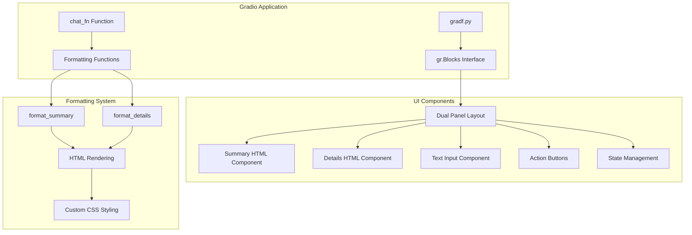
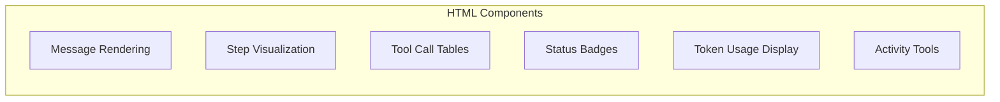
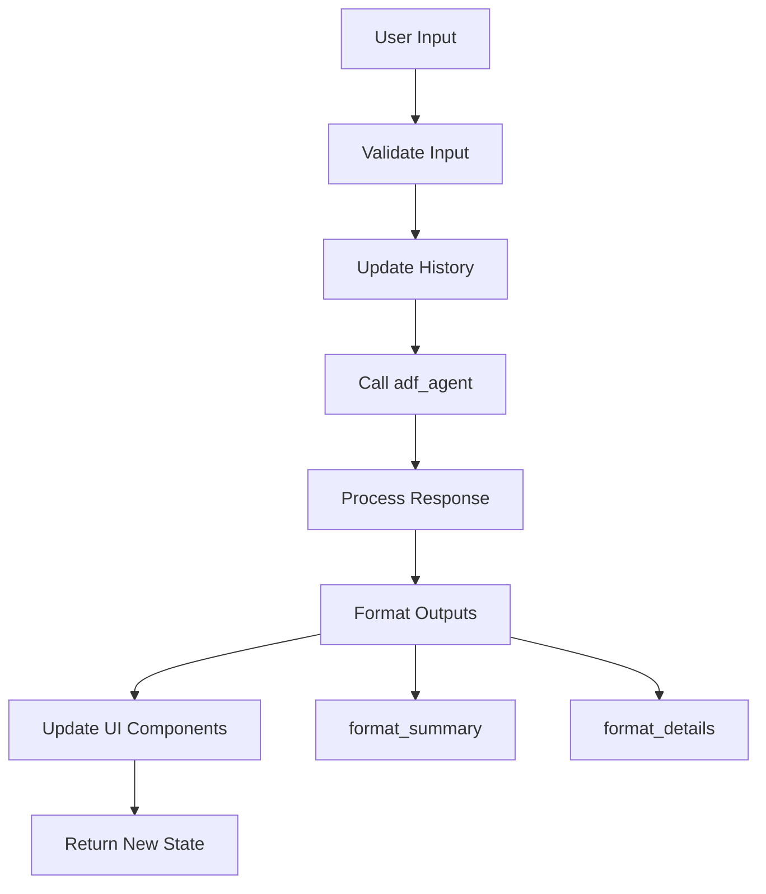
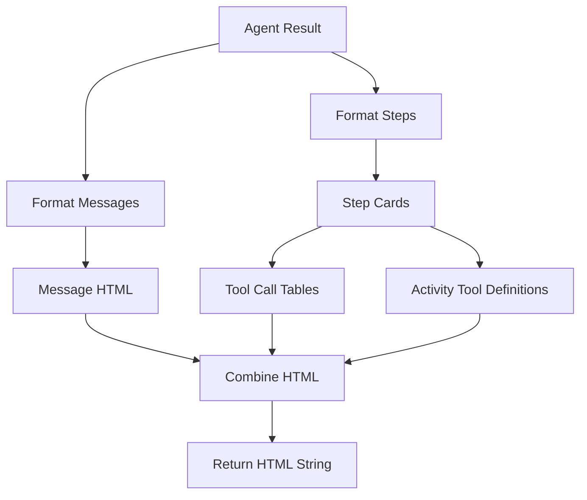
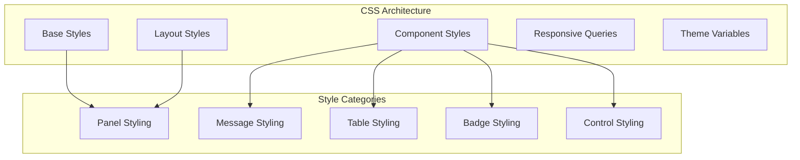
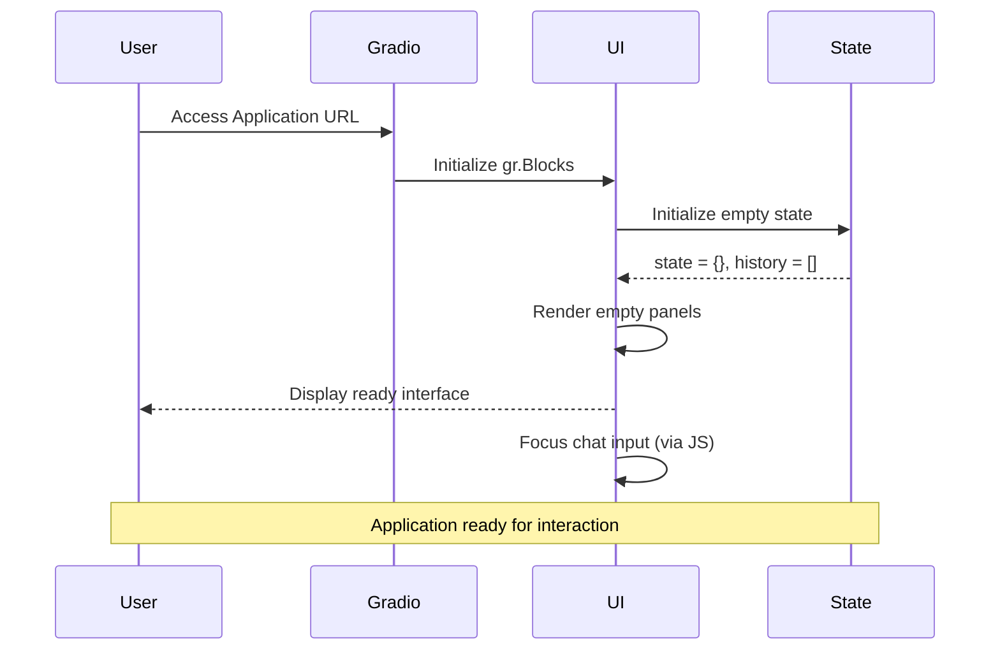
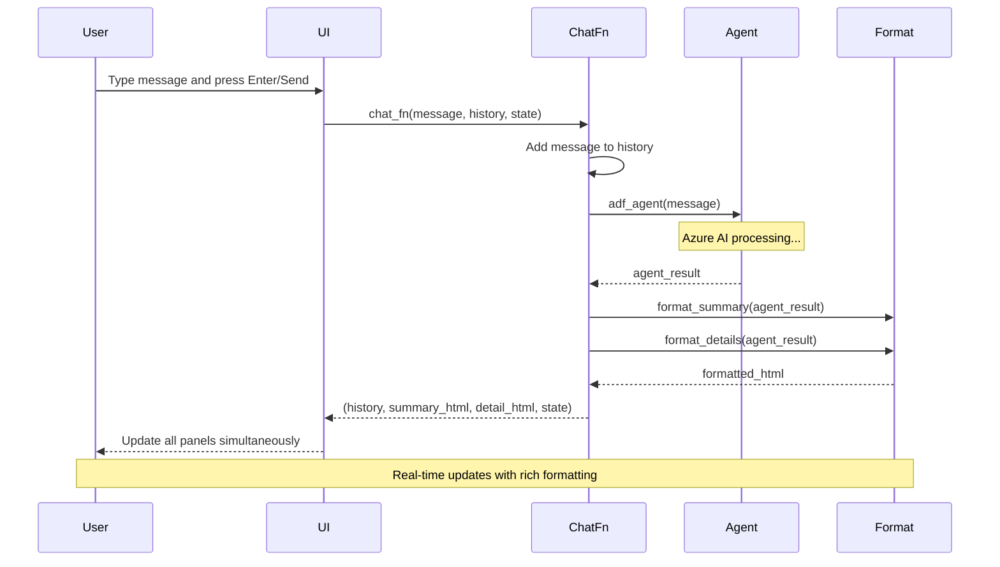
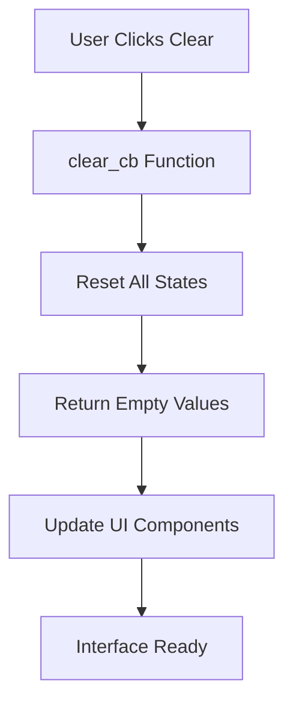
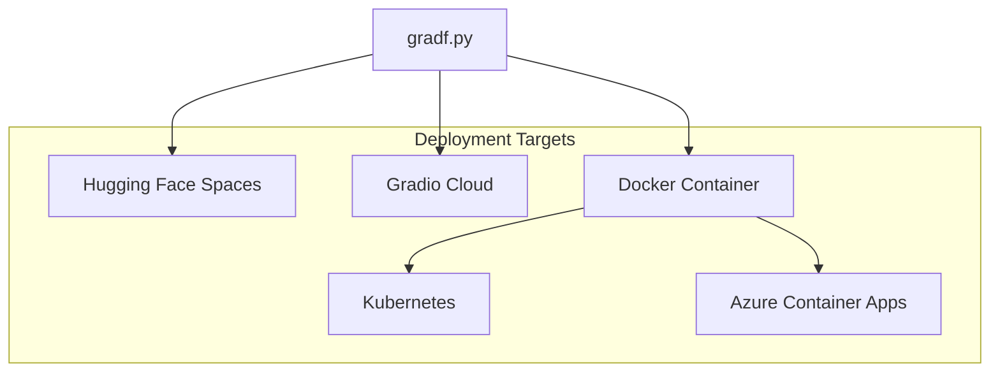

# Gradio Implementation Documentation

## Overview

The Gradio implementation (`gradf.py`) provides a modern, chat-focused interface for the Azure Data Factory Agent. This implementation emphasizes conversational interaction with a clean, responsive design optimized for chat-based workflows.

## Architecture

### Component Structure



## Key Features

### 1. Modern Chat Interface

The Gradio interface provides a conversation-focused design:

- **Dual Panel Layout**: Side-by-side summary and details panels
- **Real-time Updates**: Instant response formatting and display
- **Interactive Controls**: Send and clear buttons with keyboard shortcuts
- **State Persistence**: Conversation history and agent state management

### 2. Advanced HTML Rendering



**Key Rendering Features:**
- Rich HTML formatting for complex data structures
- Color-coded message types (user vs assistant)
- Professional table layouts for tool calls
- Status badges with contextual styling
- Responsive design elements

### 3. State Management System

```python
# State structure in Gradio
state = gr.State({})  # Stores latest agent result
history = gr.State([])  # Stores conversation history as tuples

# History format: List[Tuple[str, str]]
# [(user_message, assistant_response), ...]

# Agent result structure (same as Streamlit)
{
    "summary": "Assistant response text",
    "details": "Detailed execution log", 
    "messages": [{"role": "user|assistant", "content": "..."}],
    "steps": [{"id": "...", "status": "...", "tool_calls": [...]}],
    "token_usage": {"prompt_tokens": 123, "completion_tokens": 456},
    "status": "completed|failed|..."
}
```

## Implementation Details

### Core Functions

#### 1. `chat_fn()` - Main Chat Handler



**Implementation Details:**

```python
def chat_fn(message: str, history: List[Tuple[str, str]], state: dict):
    history = history or []
    if not message:
        return history, "<em>No summary yet.</em>", "<em>No details yet.</em>", state or {}
    
    # Add user message to history
    history.append((message, ""))
    
    # Get agent response
    agent_result = adf_agent(message)
    reply = agent_result.get("summary") or "(no reply)"
    
    # Update history with assistant response
    history[-1] = (message, reply)
    
    # Return updated components
    return (
        history, 
        format_summary(agent_result), 
        format_details(agent_result), 
        agent_result
    )
```

#### 2. `format_summary()` - Summary Panel Formatting

**Rich HTML Summary Generation:**

```python
def format_summary(agent_result: dict) -> str:
    if not agent_result:
        return "<em>No summary yet.</em>"
    
    # Extract and escape content
    raw_summary = agent_result.get("summary") or "(empty)"
    summary = raw_summary.replace("<", "&lt;").replace(">", "&gt;")
    token_usage = agent_result.get("token_usage") or {}
    status = (agent_result.get("status") or "").upper()
    
    # Generate status badge
    status_badge = f"<span class='status-badge status-{status.lower()}'>{status}</span>" if status else ""
    
    # Generate token usage badges
    badges = "".join([f"<span class='badge'>{k}: {v}</span>" for k, v in token_usage.items()]) or "<span class='empty'>No token data</span>"
    
    # Assemble HTML sections
    sections = [
        "<div class='summary-root'>",
        f"<div class='summary-header'><span class='summary-title'>Assistant Summary</span>{status_badge}</div>",
        f"<div class='summary-text'>{summary}</div>",
        "<div class='section-title small'>Token Usage</div>",
        f"<div class='summary-usage'>{badges}</div>",
        "</div>",
    ]
    return "".join(sections)
```

#### 3. `format_details()` - Details Panel Formatting

**Comprehensive Details Rendering:**



**Key Implementation Sections:**

```python
def format_details(agent_result: dict) -> str:
    if not agent_result:
        return "<em>No details yet.</em>"
    
    messages = agent_result.get("messages", [])
    steps = agent_result.get("steps", [])
    
    parts: list[str] = ["<div class='details-root'>"]
    
    # Conversation section
    parts.append("<div class='section-title'>Conversation</div>")
    if messages:
        for m in messages:
            role_raw = m.get("role", "?")
            role = role_raw.title()
            content = (m.get("content") or "").replace("<", "&lt;").replace(">", "&gt;")
            role_cls = f"msg-role-{role_raw}"
            parts.append(
                f"<div class='message {role_cls}'>"
                f"<div class='message-role'>{role}</div>"
                f"<div class='message-content'>{content}</div>"
                "</div>"
            )
    
    # Steps & tool calls section
    parts.append("<div class='section-title'>Steps & Tool Calls</div>")
    if steps:
        for s in steps:
            sid = s.get('id')
            status = s.get('status')
            parts.append(f"<div class='step-card'><div class='step-header'>Step {sid} • {status}</div>")
            
            # Tool calls table
            tcs = s.get('tool_calls') or []
            if tcs:
                parts.append("<table class='tool-table'><thead><tr><th>ID</th><th>Type</th><th>Name</th><th>Args</th><th>Output</th></tr></thead><tbody>")
                for tc in tcs:
                    # Format arguments and output
                    args_repr = str(tc.get('arguments')) if tc.get('arguments') else ''
                    output_repr = tc.get('output')
                    if output_repr:
                        out = str(output_repr)
                        output_repr = out if len(out) < 120 else out[:120] + '…'
                    
                    parts.append(
                        "<tr>"
                        f"<td><code>{tc.get('id') or ''}</code></td>"
                        f"<td>{tc.get('type') or ''}</td>"
                        f"<td>{tc.get('name') or ''}</td>"
                        f"<td><pre>{args_repr}</pre></td>"
                        f"<td><pre>{output_repr or ''}</pre></td>"
                        "</tr>"
                    )
                parts.append("</tbody></table>")
            
            # Activity tool definitions
            acts = s.get('activity_tools') or []
            if acts:
                parts.append("<div class='activity-tools'>")
                for at in acts:
                    params = ', '.join(at.get('parameters') or [])
                    parts.append(
                        f"<div class='activity-tool'>"
                        f"<span class='fname'>{at.get('function')}</span> – {at.get('description')}"
                        f"{f' <span class=\'params\'>(params: {params})</span>' if params else ''}"
                        f"</div>"
                    )
                parts.append("</div>")
            parts.append("</div>")  # step-card
    
    parts.append("</div>")  # details-root
    return "".join(parts)
```

### UI Layout System

#### Main Interface Structure

```python
with gr.Blocks(css="""...""", elem_id="root", title="ADF Agent Gradio") as demo:
    gr.Markdown(INTRO_TEXT)
    
    # State management
    state = gr.State({})
    history = gr.State([])
    
    # Dual panel layout
    with gr.Row(elem_classes=["panels-wrapper", "panels"], equal_height=True):
        with gr.Column(scale=1, min_width=400):
            summary_html = gr.HTML(value="<em>No summary yet.</em>", 
                                 elem_id="summary", 
                                 elem_classes=["panel"])
        with gr.Column(scale=1, min_width=400):
            detail_html = gr.HTML(value="<em>No details yet.</em>", 
                                elem_id="details", 
                                elem_classes=["panel"])
    
    # Bottom control bar
    with gr.Row(elem_classes=["bottom"]):
        chat_in = gr.Textbox(label="Ask", 
                           placeholder="Ask about ADF job status…", 
                           lines=2, 
                           elem_id="chatbox")
        send_btn = gr.Button("Send", variant="primary")
        clear_btn = gr.Button("Clear")
```

## Advanced CSS Styling

### Responsive Design System



**Key CSS Features:**

```css
/* Full-height application layout */
body, html {
    height: 100vh; 
    margin: 0; 
    padding: 0; 
    font-family: 'Segoe UI', Arial, sans-serif;
}

/* Flexible panel system */
.panels {
    display: flex; 
    gap: 12px; 
    height: 100%;
}

.panel {
    flex: 1 1 50%; 
    border: 1px solid #d9dde2; 
    border-radius: 10px; 
    background: #fff; 
    box-shadow: 0 2px 4px rgba(0,0,0,0.06); 
    padding: 14px; 
    height: 600px; 
    overflow-y: auto;
}

/* Fixed bottom controls */
.bottom {
    position: fixed; 
    bottom: 0; 
    left: 0; 
    right: 0; 
    border-top: 1px solid #d9dde2; 
    background: #ffffff; 
    padding: 10px 14px; 
    display: flex; 
    gap: 10px; 
    align-items: flex-end; 
    box-shadow: 0 -3px 8px rgba(0,0,0,0.08);
}

/* Message type styling */
.msg-role-user {
    background: #eef6ff;
}

.msg-role-assistant {
    background: #f4f9f2;
}

/* Professional table styling */
.tool-table {
    width: 100%; 
    border-collapse: collapse; 
    margin: 4px 0 6px; 
    font-size: 11px;
}

.tool-table th {
    background: #f1f3f5; 
    text-align: left; 
    padding: 4px 6px; 
    border-bottom: 1px solid #d9dde2; 
    font-weight: 600;
}

/* Status badges */
.status-badge {
    display: inline-block; 
    padding: 4px 8px; 
    border-radius: 14px; 
    font-size: 10px; 
    letter-spacing: .75px; 
    font-weight: 600; 
    background: #eef2f6; 
    border: 1px solid #d0d5da; 
    color: #333;
}

.status-badge.status-failed {
    background: #ffecec; 
    border-color: #f5b5b5; 
    color: #b30000;
}

.status-badge.status-completed {
    background: #edf9f2; 
    border-color: #b7e4c7; 
    color: #176c35;
}
```

## User Experience Flow

### Initial Application Load



### Chat Interaction Flow



### Clear History Flow



## Advantages of Gradio Implementation

### 1. **Modern Chat Experience**
- Conversation-focused design optimized for chat workflows
- Real-time response formatting and display
- Intuitive keyboard shortcuts and controls

### 2. **Rich HTML Rendering**
- Advanced HTML formatting with custom CSS
- Professional table layouts for complex data
- Color-coded status indicators and badges

### 3. **Responsive Design**
- Mobile-friendly responsive layout
- Flexible panel system that adapts to screen size
- Optimized for various device types

### 4. **State Persistence**
- Robust state management system
- Conversation history preservation
- Seamless state updates across interactions

### 5. **Development Efficiency**
- Rapid prototyping capabilities
- Built-in component library
- Easy deployment options

## Customization & Extension

### Theme Customization

```python
# Custom CSS injection for branding
custom_css = """
.summary-root {
    font-family: 'Custom Font', sans-serif;
}

.status-badge {
    /* Custom brand colors */
    --brand-primary: #your-color;
    --brand-secondary: #your-color;
}
"""

# Apply during Blocks creation
with gr.Blocks(css=custom_css) as demo:
    # ... interface components
```

### Component Extensions

```python
# Add new UI components
with gr.Row():
    export_btn = gr.Button("Export Conversation")
    settings_btn = gr.Button("Settings")

# Extend functionality
def export_conversation(history):
    # Export logic
    return history

export_btn.click(export_conversation, inputs=[history], outputs=[])
```

### Custom Formatting Functions

```python
def custom_format_summary(agent_result: dict) -> str:
    # Custom summary formatting logic
    # Add business-specific formatting
    # Include additional metadata
    return custom_html

def custom_format_details(agent_result: dict) -> str:
    # Custom details formatting logic
    # Add debugging information
    # Include performance metrics
    return custom_html
```

## Performance Optimization

### Memory Management

```python
# Efficient state management
def chat_fn(message: str, history: List[Tuple[str, str]], state: dict):
    # Limit history size to prevent memory issues
    MAX_HISTORY = 50
    if len(history) > MAX_HISTORY:
        history = history[-MAX_HISTORY:]
    
    # Clear large state objects when not needed
    if 'large_data' in state:
        del state['large_data']
    
    return history, summary_html, detail_html, state
```

### Rendering Optimization

```python
# Lazy HTML generation
def format_details(agent_result: dict) -> str:
    if not agent_result:
        return "<em>No details yet.</em>"
    
    # Only render complex sections when data exists
    messages = agent_result.get("messages", [])
    if not messages:
        return "<em>No conversation details.</em>"
    
    # Use efficient string building
    parts = []
    # ... build parts efficiently
    return "".join(parts)  # More efficient than string concatenation
```

## Deployment Options

### Local Development

```bash
python gradf.py
```

### Production Deployment



### Environment Configuration

```python
# Production-ready configuration
if __name__ == "__main__":
    import os
    
    # Configure for production
    port = int(os.environ.get("PORT", 7860))
    host = os.environ.get("HOST", "0.0.0.0")
    
    demo.queue(
        concurrency_count=10,  # Handle concurrent users
        max_size=20           # Queue size limit
    ).launch(
        server_name=host,
        server_port=port,
        share=False,          # Disable sharing for production
        debug=False,          # Disable debug mode
        enable_queue=True     # Enable queuing for stability
    )
```

## Troubleshooting

### Common Issues

1. **CSS Not Applied**
   ```python
   # Ensure CSS is properly formatted
   with gr.Blocks(css="""
   /* Valid CSS only */
   .class-name { property: value; }
   """) as demo:
   ```

2. **State Management Issues**
   ```python
   # Always return all state components
   def chat_fn(message, history, state):
       # ... processing
       return history, summary_html, detail_html, state  # All 4 components
   ```

3. **HTML Rendering Problems**
   ```python
   # Proper HTML escaping
   content = content.replace("<", "&lt;").replace(">", "&gt;")
   ```

### Debug Mode

```python
# Enable debug logging
import logging
logging.basicConfig(level=logging.DEBUG)

# Launch with debug mode
demo.launch(debug=True)
```

This comprehensive Gradio implementation provides a modern, efficient interface for Azure Data Factory operations with advanced chat capabilities and professional styling.