# MCP Integration Guide

## Overview

The Model Context Protocol (MCP) integration is a core architectural component that enables the Azure Data Factory Agent to access external tools and services in a standardized way. This guide provides comprehensive documentation on how MCP is implemented and utilized in both Streamlit and Gradio interfaces.

## What is MCP?

Model Context Protocol (MCP) is a protocol designed to enable AI models to securely interact with external tools and data sources. In the Azure Data Factory Agent, MCP serves as the bridge between the AI agent and Azure Data Factory APIs.

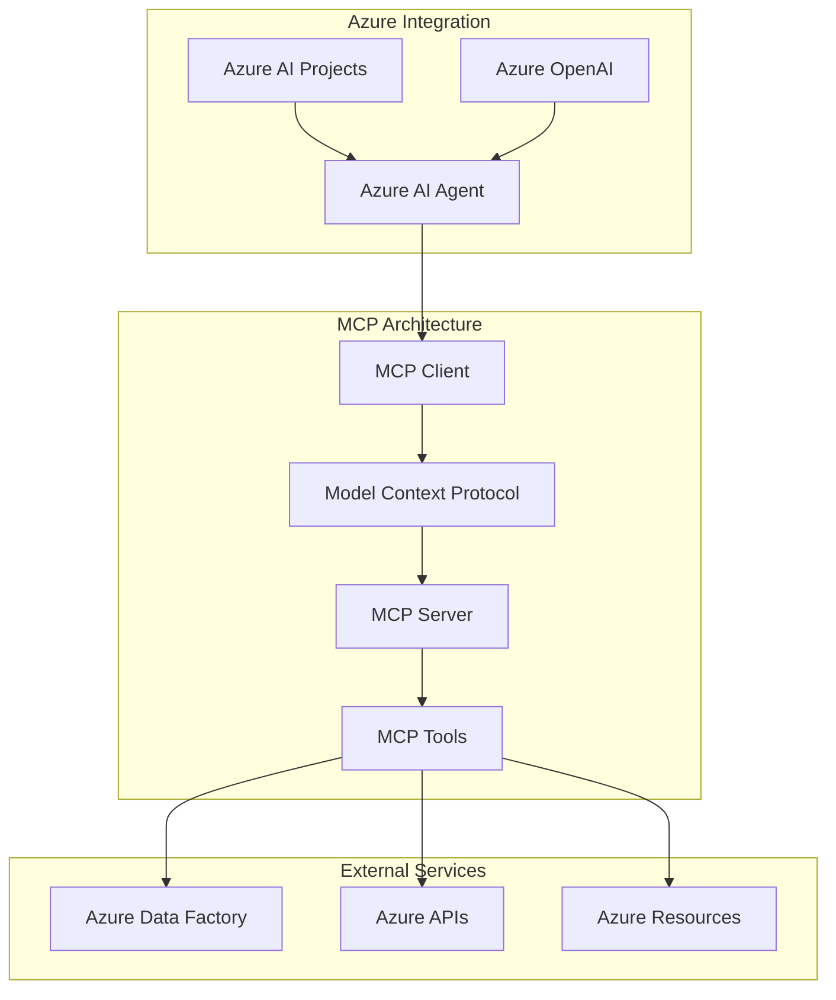

## MCP Implementation Architecture

### Core Components

#### 1. MCP Tool Configuration

```python
# MCP server configuration from environment variables
mcp_server_url = os.environ.get("MCP_SERVER_URL", "https://learn.microsoft.com/api/mcp")
mcp_server_label = os.environ.get("MCP_SERVER_LABEL", "MicrosoftLearn")

# MCP tool initialization
mcp_tool = McpTool(
    server_label=mcp_server_label,
    server_url=mcp_server_url,
    allowed_tools=[],  # Empty list allows all available tools
)
```

#### 2. Agent Integration

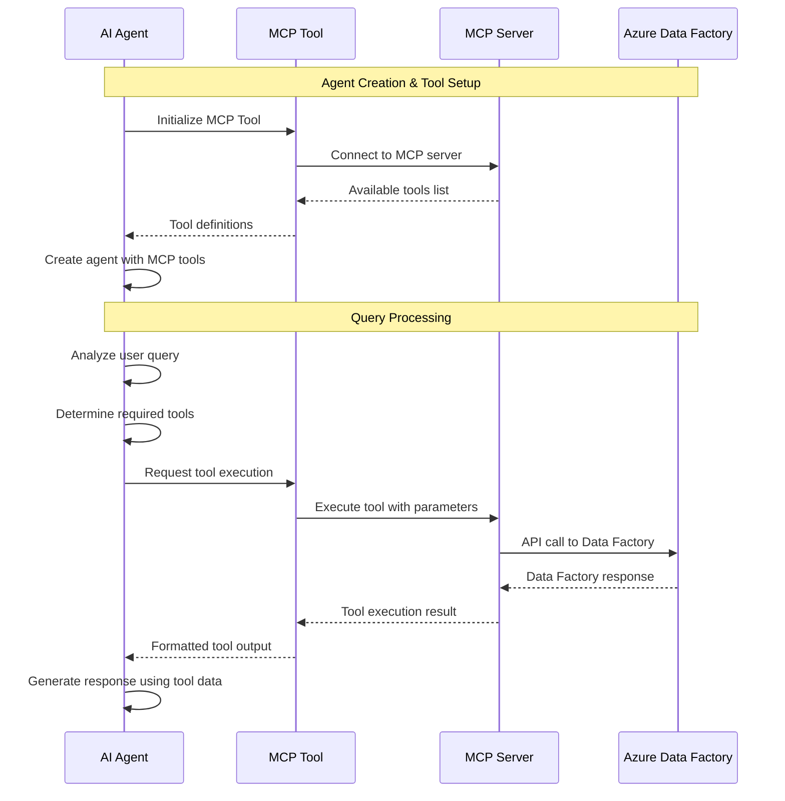

### Tool Approval Workflow

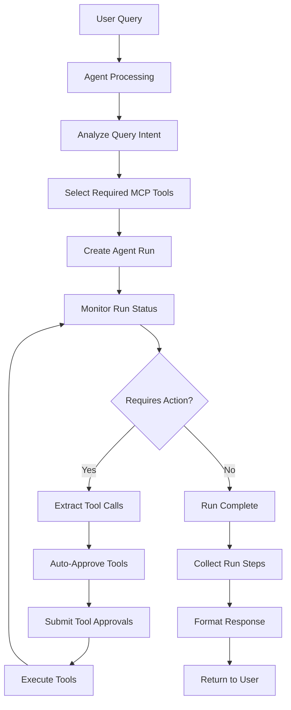

## Tool Execution Flow

### 1. Tool Call Detection

```python
# Monitor agent run for tool calls
while run.status in ["queued", "in_progress", "requires_action"]:
    time.sleep(0.8)
    run = agents_client.runs.get(thread_id=thread.id, run_id=run.id)
    
    if run.status == "requires_action" and isinstance(run.required_action, SubmitToolApprovalAction):
        tool_calls = run.required_action.submit_tool_approval.tool_calls or []
        if not tool_calls:
            log("No tool calls – cancelling run")
            agents_client.runs.cancel(thread_id=thread.id, run_id=run.id)
            break
```

### 2. Tool Approval Process

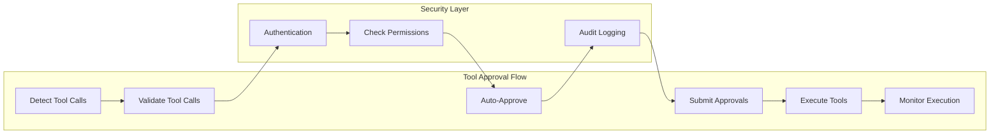

```python
# Auto-approve MCP tool calls
approvals = []
for tc in tool_calls:
    if isinstance(tc, RequiredMcpToolCall):
        log(f"Approving tool call {tc.id}")
        approvals.append(ToolApproval(
            tool_call_id=tc.id, 
            approve=True, 
            headers=mcp_tool.headers
        ))

if approvals:
    agents_client.runs.submit_tool_outputs(
        thread_id=thread.id, 
        run_id=run.id, 
        tool_approvals=approvals
    )
```

### 3. Tool Execution Monitoring

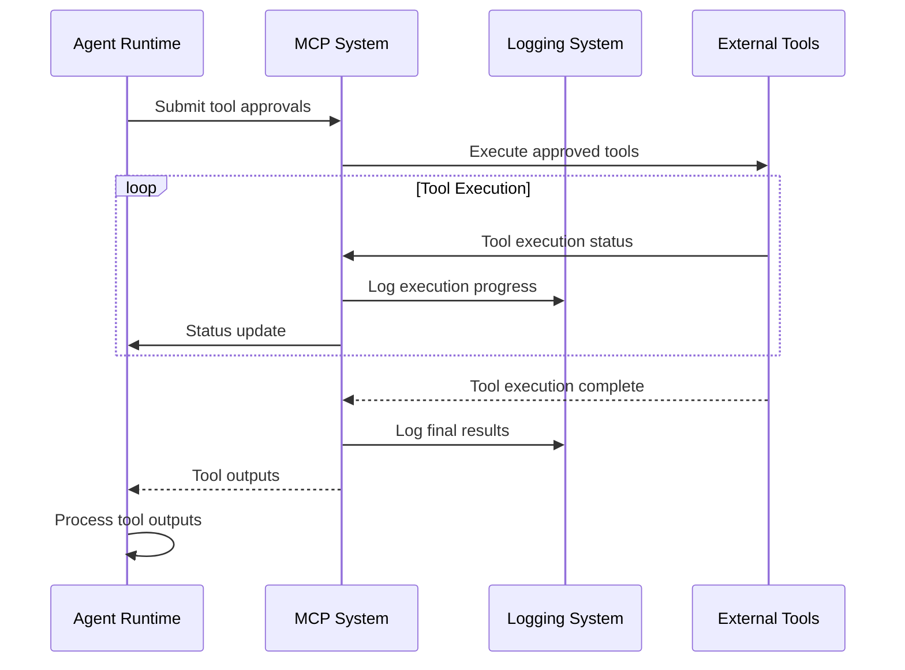

## Available MCP Tools

### 1. Azure Data Factory Tools

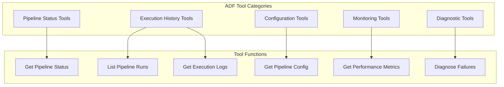

**Example Tool Definitions:**

```python
# Tool definition structure (returned from MCP server)
{
    "function": "get_pipeline_status",
    "description": "Get current status of Azure Data Factory pipelines",
    "parameters": ["pipeline_name", "resource_group", "factory_name"],
    "required": ["factory_name"]
}

{
    "function": "get_pipeline_runs",
    "description": "Get execution history for Data Factory pipelines",
    "parameters": ["pipeline_name", "start_date", "end_date", "status_filter"],
    "required": ["pipeline_name"]
}

{
    "function": "diagnose_pipeline_failure",
    "description": "Analyze pipeline failure and provide diagnostics",
    "parameters": ["pipeline_run_id", "include_logs", "analysis_depth"],
    "required": ["pipeline_run_id"]
}
```

### 2. Microsoft Learn Integration

The default MCP server (`https://learn.microsoft.com/api/mcp`) provides access to Microsoft documentation and learning resources:

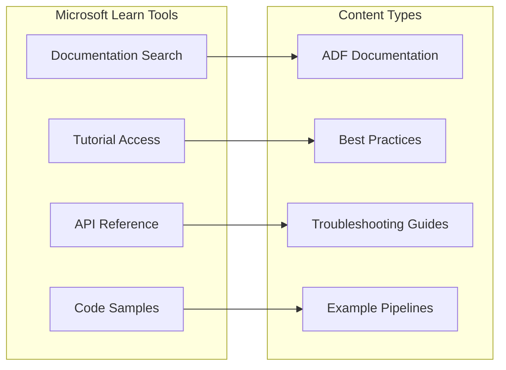

## Response Processing and Formatting

### 1. Tool Output Collection

```python
# Collect structured tool call information
for step in run_steps:
    sid = step.get('id')
    sstatus = step.get('status')
    sd = step.get("step_details", {})
    
    # Extract tool calls
    tool_calls_raw = []
    if isinstance(sd, dict):
        tool_calls_raw = sd.get("tool_calls", []) or []
    
    structured_tool_calls = []
    for call in tool_calls_raw:
        structured_tool_calls.append({
            "id": call.get('id'),
            "type": call.get('type'),
            "name": call.get('name'),
            "arguments": call.get('arguments'),
            "output": call.get('output'),
        })
```

### 2. Response Data Structure

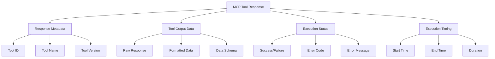

### 3. UI Integration

#### Streamlit Display

```python
# Tool calls rendering in Streamlit
if s.get('tool_calls'):
    for tc in s['tool_calls']:
        steps_html_parts.append(
            "<div style='margin-left:6px; font-size:0.6rem; padding:2px 0;'>"
            f"<code>{tc.get('id') or 'tool'}</code> "
            f"<span style='color:#555;'>{tc.get('type')}</span> "
            f"<strong>{(tc.get('name') or '')}</strong>"
            f"{ ' args=' + str(tc.get('arguments')) if tc.get('arguments') else ''}"
            f"{ ' → ' + str(tc.get('output'))[:120] + ('…' if tc.get('output') and len(str(tc.get('output'))) > 120 else '') if tc.get('output') else ''}"
            "</div>"
        )
```

#### Gradio Display

```python
# Tool calls table rendering in Gradio
if tcs:
    parts.append("<table class='tool-table'><thead><tr><th>ID</th><th>Type</th><th>Name</th><th>Args</th><th>Output</th></tr></thead><tbody>")
    for tc in tcs:
        args_repr = str(tc.get('arguments')) if tc.get('arguments') else ''
        output_repr = tc.get('output')
        if output_repr:
            out = str(output_repr)
            output_repr = out if len(out) < 120 else out[:120] + '…'
        
        parts.append(
            "<tr>"
            f"<td><code>{tc.get('id') or ''}</code></td>"
            f"<td>{tc.get('type') or ''}</td>"
            f"<td>{tc.get('name') or ''}</td>"
            f"<td><pre>{args_repr}</pre></td>"
            f"<td><pre>{output_repr or ''}</pre></td>"
            "</tr>"
        )
    parts.append("</tbody></table>")
```

## Security and Authentication

### 1. MCP Security Model

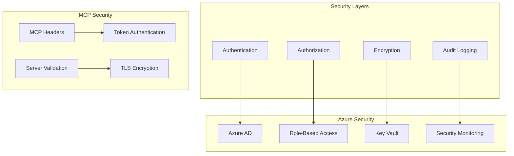

### 2. Authentication Flow

```python
# MCP tool with authentication headers
mcp_tool = McpTool(
    server_label=mcp_server_label,
    server_url=mcp_server_url,
    allowed_tools=[],  # Allow all tools
)

# Tool approvals include authentication headers
approvals.append(ToolApproval(
    tool_call_id=tc.id, 
    approve=True, 
    headers=mcp_tool.headers  # Include auth headers
))
```

### 3. Permission Model

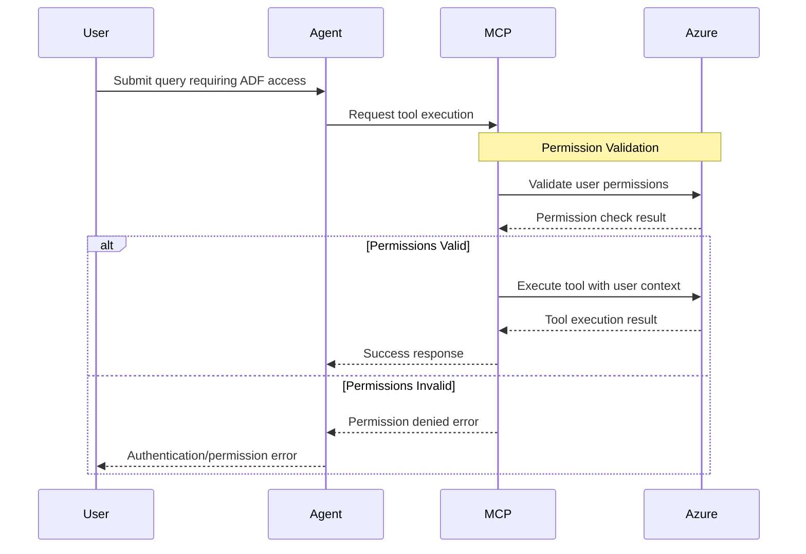

## Configuration and Customization

### 1. Environment Configuration

```bash
# MCP server configuration
export MCP_SERVER_URL="https://your-mcp-server.com/api/mcp"
export MCP_SERVER_LABEL="CustomMCPServer"

# Azure configuration for MCP tools
export AZURE_TENANT_ID="your-tenant-id"
export AZURE_CLIENT_ID="your-client-id"
export AZURE_CLIENT_SECRET="your-client-secret"

# Data Factory specific configuration
export ADF_SUBSCRIPTION_ID="your-subscription-id"
export ADF_RESOURCE_GROUP="your-resource-group"
export ADF_FACTORY_NAME="your-factory-name"
```

### 2. Custom MCP Server Integration

```python
# Custom MCP server configuration
custom_mcp_tool = McpTool(
    server_label="CustomADFTools",
    server_url="https://your-custom-mcp-server.com/api/mcp",
    allowed_tools=["get_pipeline_status", "diagnose_failures"],  # Restrict tools
)

# Enhanced agent with custom tools
agent = agents_client.create_agent(
    model=os.environ["MODEL_DEPLOYMENT_NAME"],
    name="custom-adf-agent",
    instructions="You are an ADF expert with access to custom diagnostic tools.",
    tools=custom_mcp_tool.definitions,
)
```

### 3. Tool Filtering and Restrictions

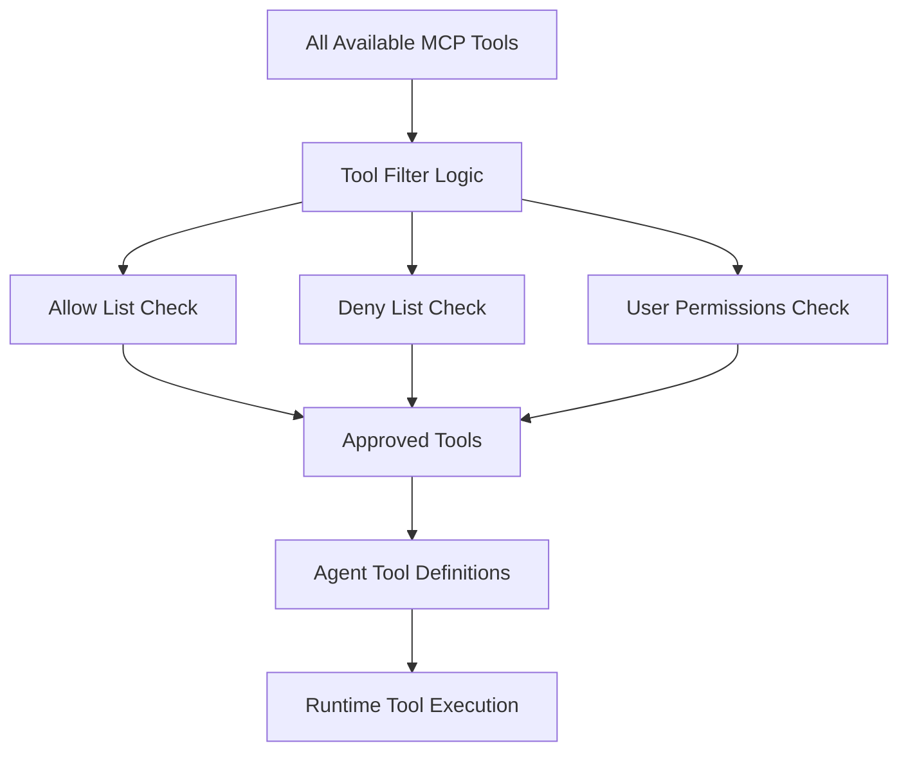

## Error Handling and Troubleshooting

### 1. Common MCP Errors

| Error Type | Cause | Solution |
|------------|-------|----------|
| Connection Timeout | MCP server unreachable | Check server URL and network connectivity |
| Authentication Failed | Invalid credentials | Verify MCP server authentication |
| Tool Not Found | Tool not available | Check tool name and server capabilities |
| Permission Denied | Insufficient permissions | Verify Azure RBAC settings |
| Rate Limiting | Too many requests | Implement request throttling |

### 2. Error Recovery Flow

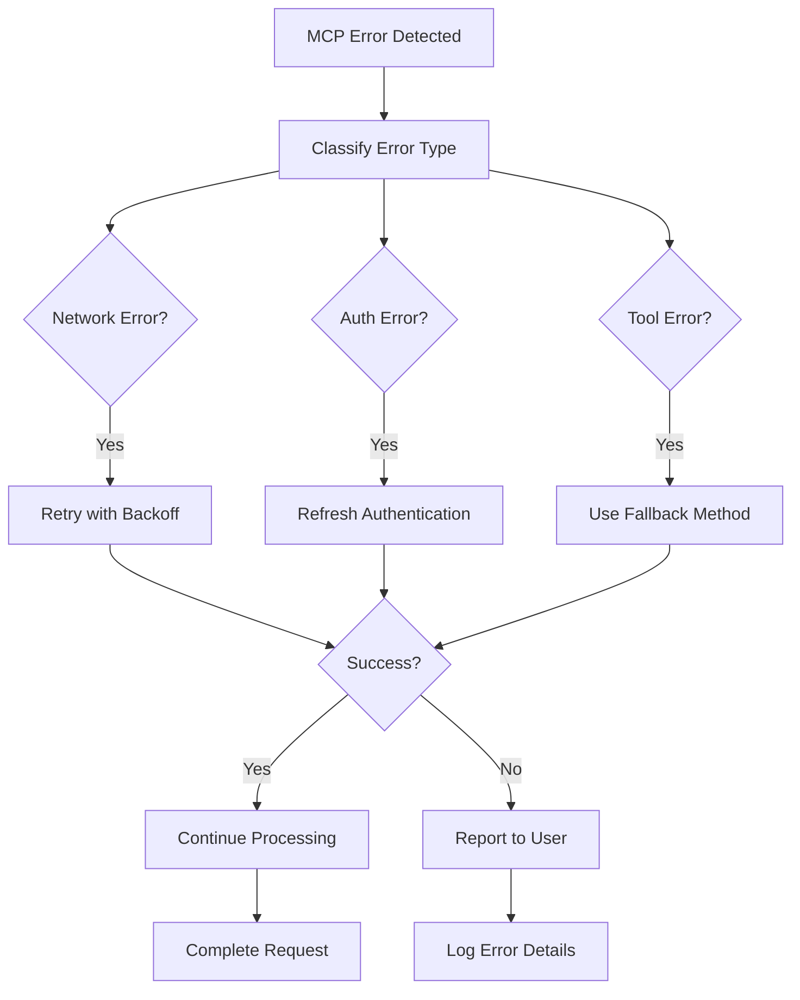

### 3. Diagnostic Information

```python
# Enhanced logging for MCP tool execution
def log_mcp_execution(tool_call, result, error=None):
    log_entry = {
        "timestamp": datetime.utcnow().isoformat(),
        "tool_id": tool_call.get('id'),
        "tool_name": tool_call.get('name'),
        "tool_type": tool_call.get('type'),
        "arguments": tool_call.get('arguments'),
        "success": error is None,
        "error": str(error) if error else None,
        "execution_time": result.get('execution_time') if result else None,
        "output_size": len(str(result.get('output', ''))) if result else 0
    }
    
    print(f"MCP Tool Execution: {json.dumps(log_entry, indent=2)}")
```

## Performance Optimization

### 1. Caching Strategy

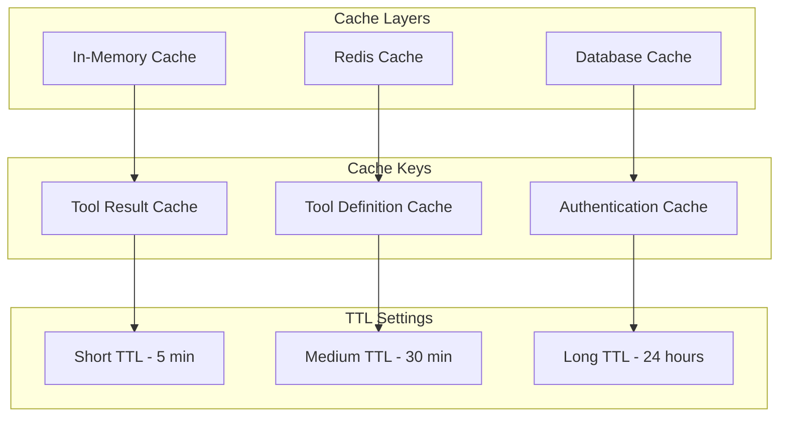

### 2. Connection Pooling

```python
# MCP connection pool configuration
class MCPConnectionPool:
    def __init__(self, server_url, pool_size=10):
        self.server_url = server_url
        self.pool_size = pool_size
        self.connections = []
        self._initialize_pool()
    
    def _initialize_pool(self):
        for _ in range(self.pool_size):
            connection = MCPConnection(self.server_url)
            self.connections.append(connection)
    
    def get_connection(self):
        # Return available connection from pool
        pass
    
    def return_connection(self, connection):
        # Return connection to pool
        pass
```

## Future Enhancements

### 1. Advanced MCP Features

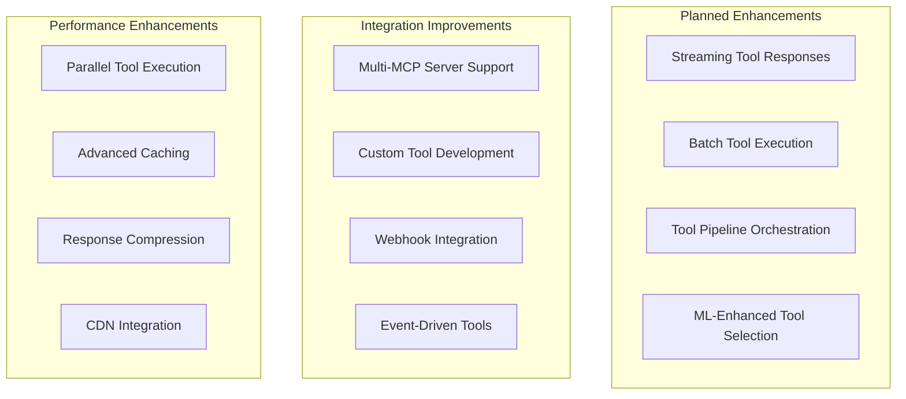

### 2. Monitoring and Analytics

```python
# MCP analytics tracking
class MCPAnalytics:
    def track_tool_usage(self, tool_name, execution_time, success):
        metrics = {
            "tool_name": tool_name,
            "execution_time": execution_time,
            "success": success,
            "timestamp": datetime.utcnow()
        }
        self.send_to_analytics(metrics)
    
    def get_usage_statistics(self):
        return {
            "total_calls": self.get_total_calls(),
            "success_rate": self.get_success_rate(),
            "avg_execution_time": self.get_avg_execution_time(),
            "top_tools": self.get_most_used_tools()
        }
```

This comprehensive MCP integration guide provides all the necessary information for understanding, implementing, and maintaining the Model Context Protocol integration within the Azure Data Factory Agent system.