# stadfops.py Architecture Blueprint

## Executive Summary

The Azure Data Factory Operations Agent (`stadfops.py`) represents an enterprise-grade evolution of the base ADF Agent, specifically designed for production operations and real-time monitoring of Azure Data Factory environments. This architecture blueprint outlines the technical design, operational enhancements, and production deployment patterns.

## Architectural Philosophy

### Design Principles

1. **Operations-First Design**: Built specifically for production monitoring and incident response
2. **Direct Integration**: Native Azure Data Factory API integration for real-time data access
3. **Production Resilience**: Enhanced error handling, timeout management, and graceful degradation
4. **Security by Design**: Enterprise authentication patterns and compliance-ready architecture
5. **Extensible Framework**: Modular design supporting future operational tool additions

## System Architecture

### Layered Architecture Overview

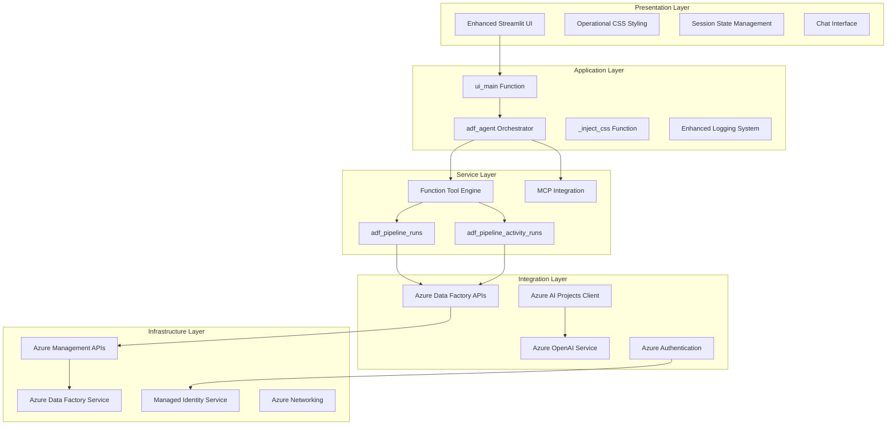

### Component Interaction Model

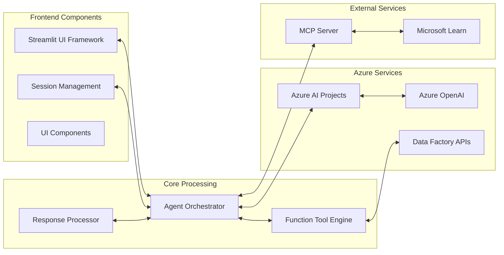

## Core Components Deep Dive

### 1. Function Tool Engine

The Function Tool Engine represents a significant architectural advancement over the basic version, providing direct operational capabilities.

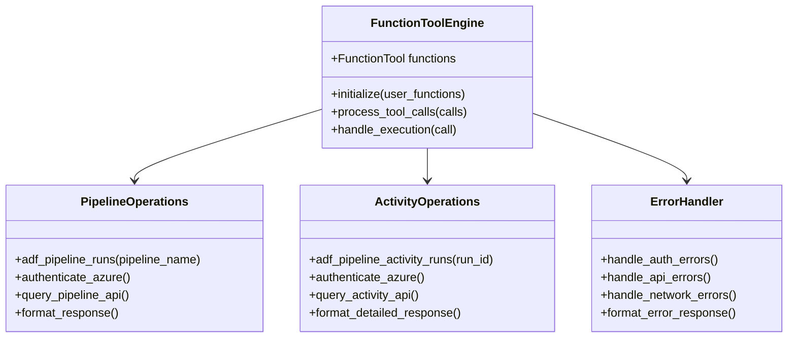

### 2. Azure Data Factory Integration

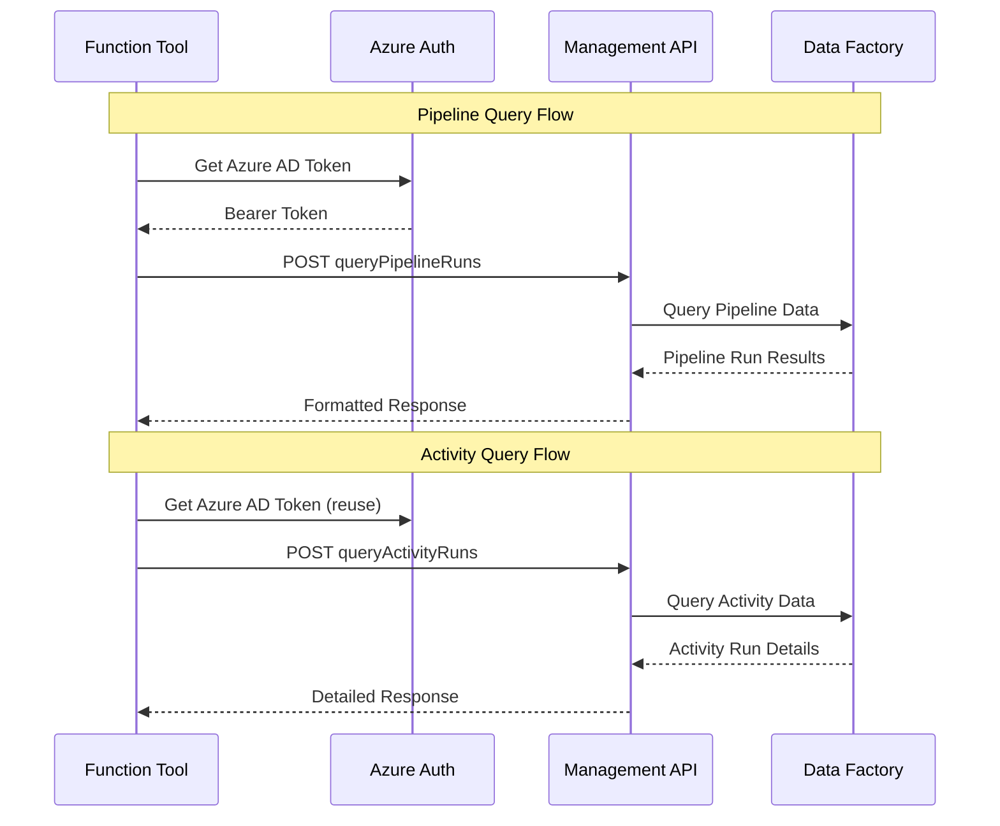

### 3. Enhanced UI Architecture

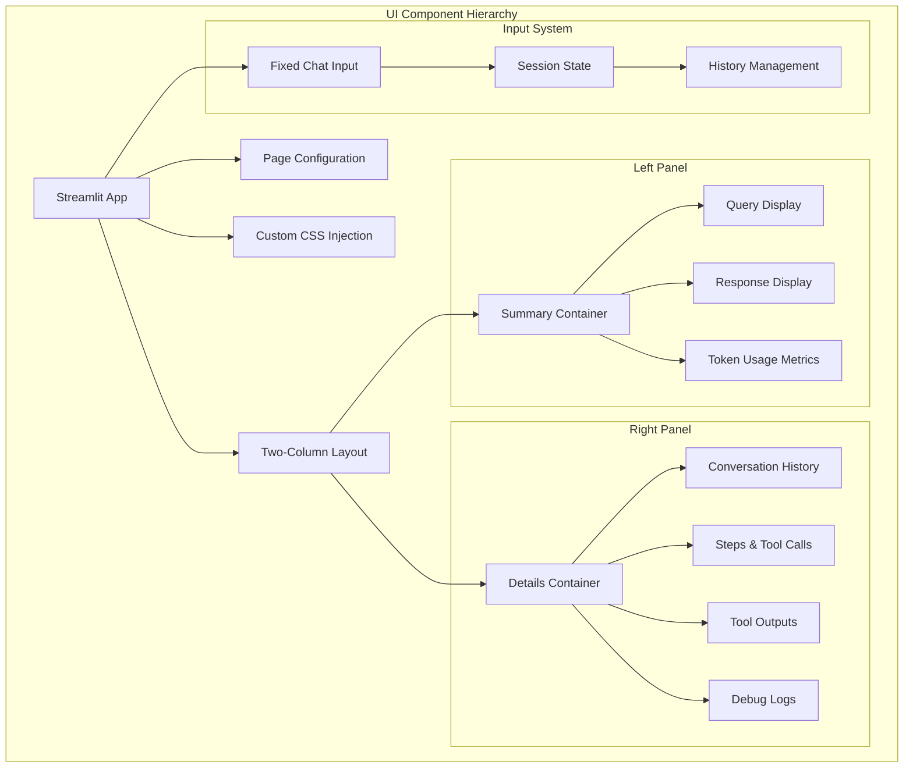

## Data Flow Architecture

### Request Processing Pipeline

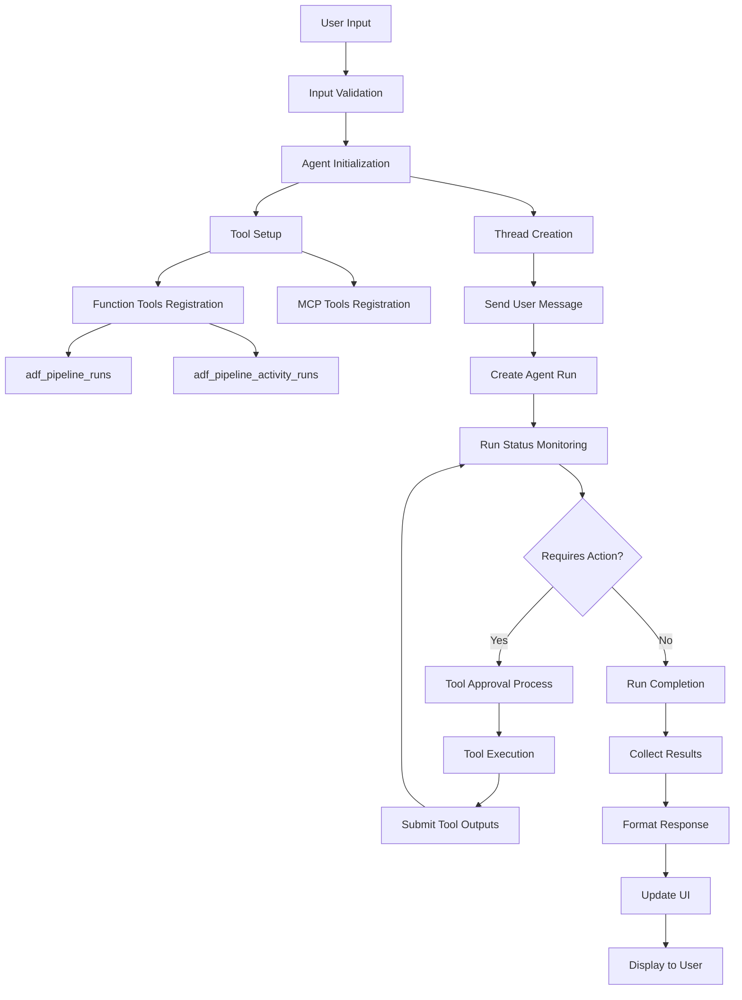

### Data Transformation Flow

```mermaid
graph LR
    subgraph "Input Processing"
        UserQuery[User Query]
        QueryParsing[Query Parsing]
        IntentAnalysis[Intent Analysis]
    end
    
    subgraph "Data Retrieval"
        ADFAPICalls[ADF API Calls]
        PipelineData[Pipeline Data]
        ActivityData[Activity Data]
    end
    
    subgraph "Data Processing"
        DataFiltering[Data Filtering]
        DataAggregation[Data Aggregation]
        DataFormatting[Data Formatting]
    end
    
    subgraph "Response Generation"
        AIProcessing[AI Processing]
        ResponseGeneration[Response Generation]
        UIFormatting[UI Formatting]
    end
    
    UserQuery --> QueryParsing
    QueryParsing --> IntentAnalysis
    IntentAnalysis --> ADFAPICalls
    ADFAPICalls --> PipelineData
    ADFAPICalls --> ActivityData
    PipelineData --> DataFiltering
    ActivityData --> DataFiltering
    DataFiltering --> DataAggregation
    DataAggregation --> DataFormatting
    DataFormatting --> AIProcessing
    AIProcessing --> ResponseGeneration
    ResponseGeneration --> UIFormatting
```

## Security Architecture

### Authentication & Authorization Flow

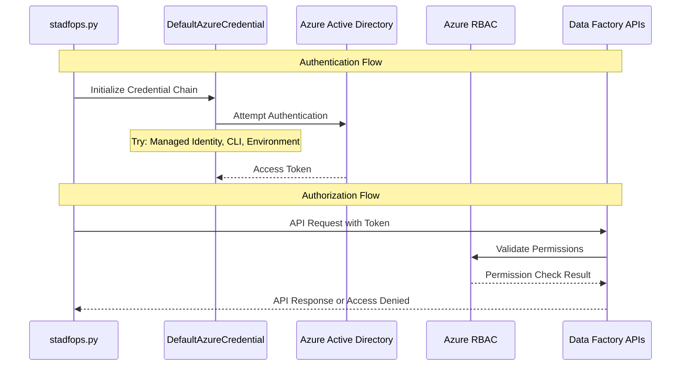

### Security Boundaries

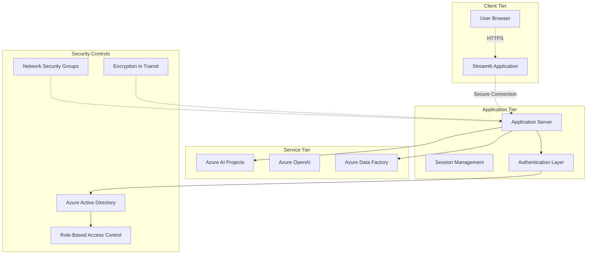

## Scalability & Performance

### Performance Architecture

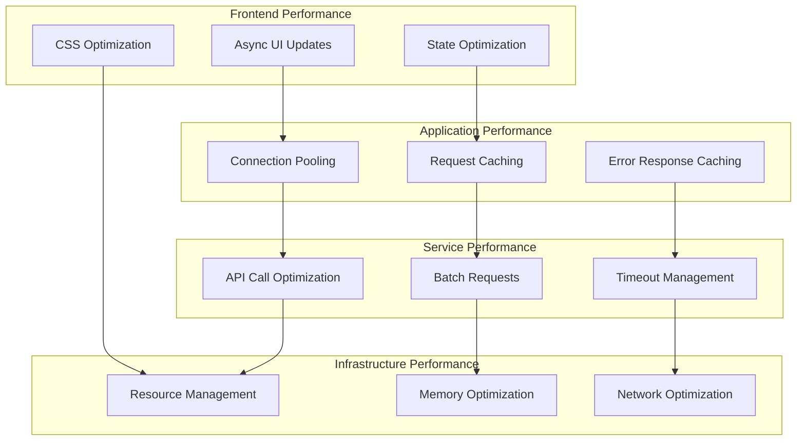

### Deployment Patterns

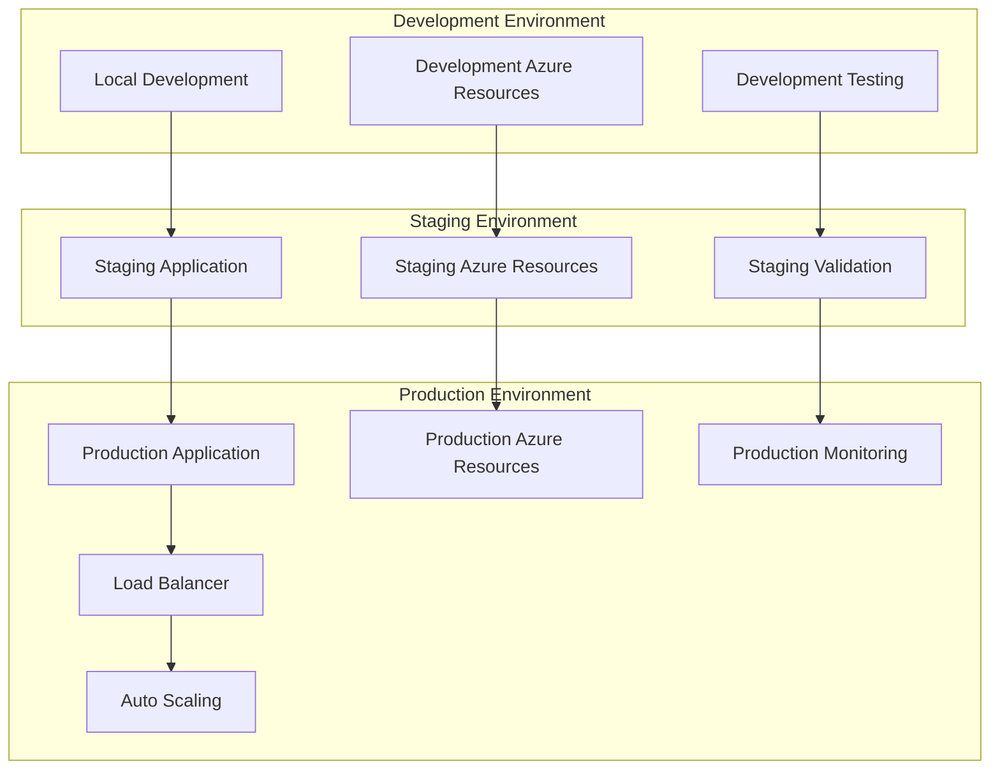

## Technology Stack

### Core Technologies

| Layer | Technology | Purpose | Version |
|-------|------------|---------|---------|
| **Frontend** | Streamlit | Web UI Framework | Latest |
| **Backend** | Python | Application Logic | 3.8+ |
| **AI/ML** | Azure OpenAI | Language Model | GPT-4 |
| **Integration** | Azure AI Projects | Agent Framework | Latest |
| **Data Source** | Azure Data Factory | Data Pipeline Platform | Latest |
| **Authentication** | Azure AD | Identity Management | Latest |
| **Deployment** | Docker/Azure | Container Platform | Latest |

### Dependencies

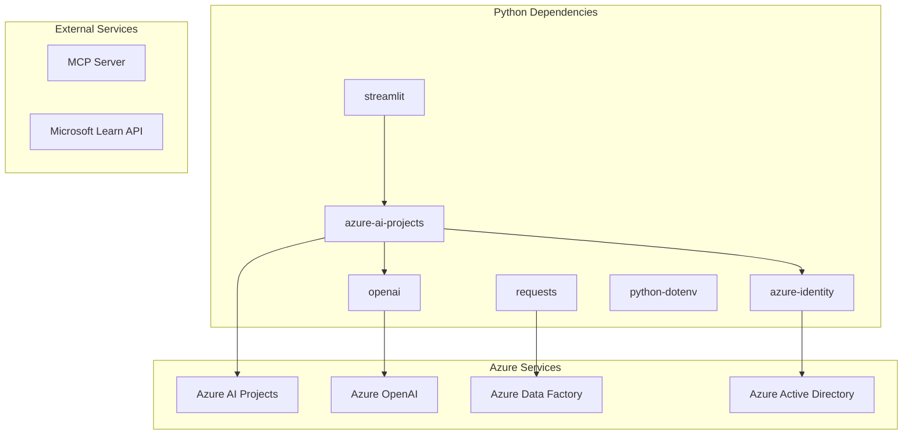

## Operational Considerations

### Monitoring & Observability

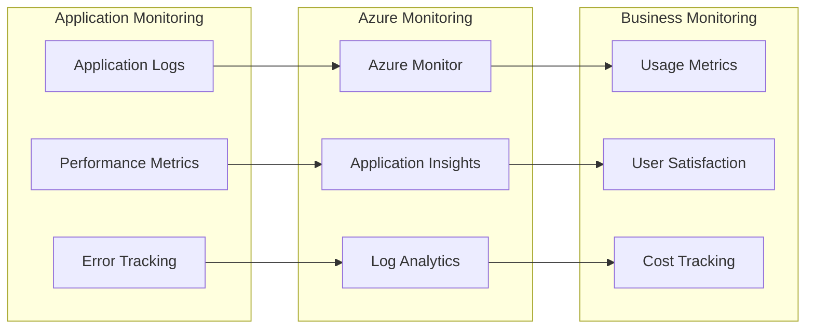

### Maintenance & Updates

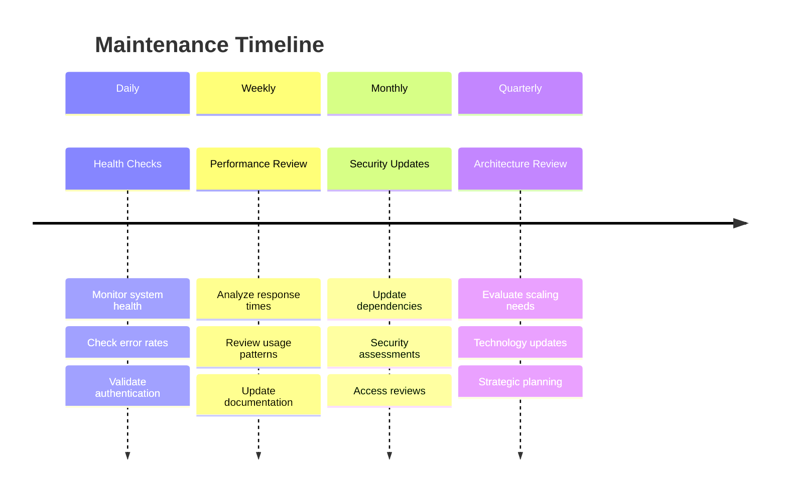

This architecture blueprint provides the technical foundation for understanding, deploying, and maintaining the Azure Data Factory Operations Agent in enterprise environments.