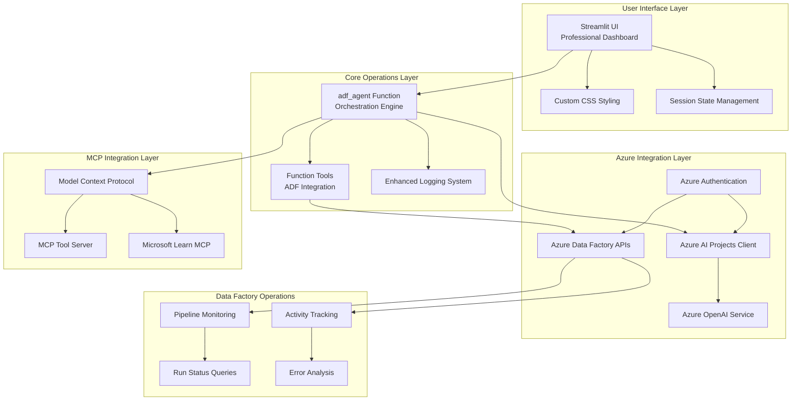
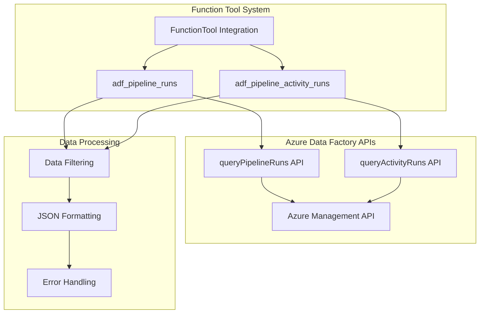
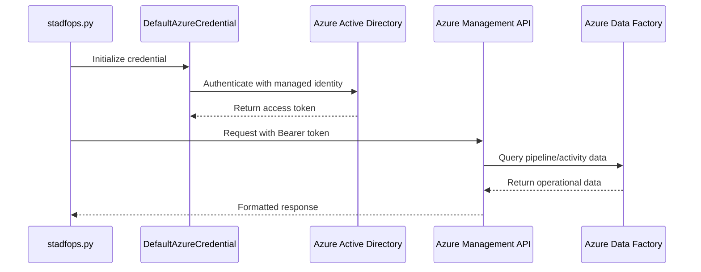
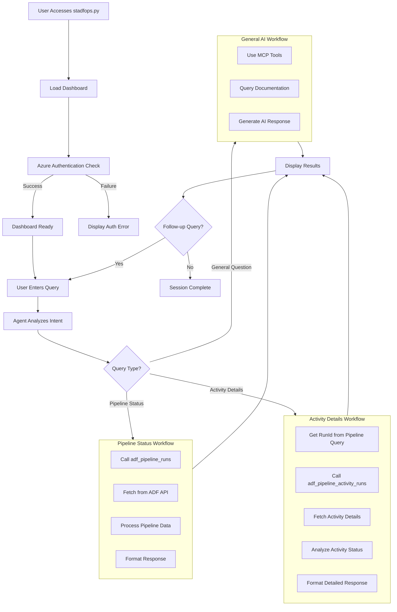
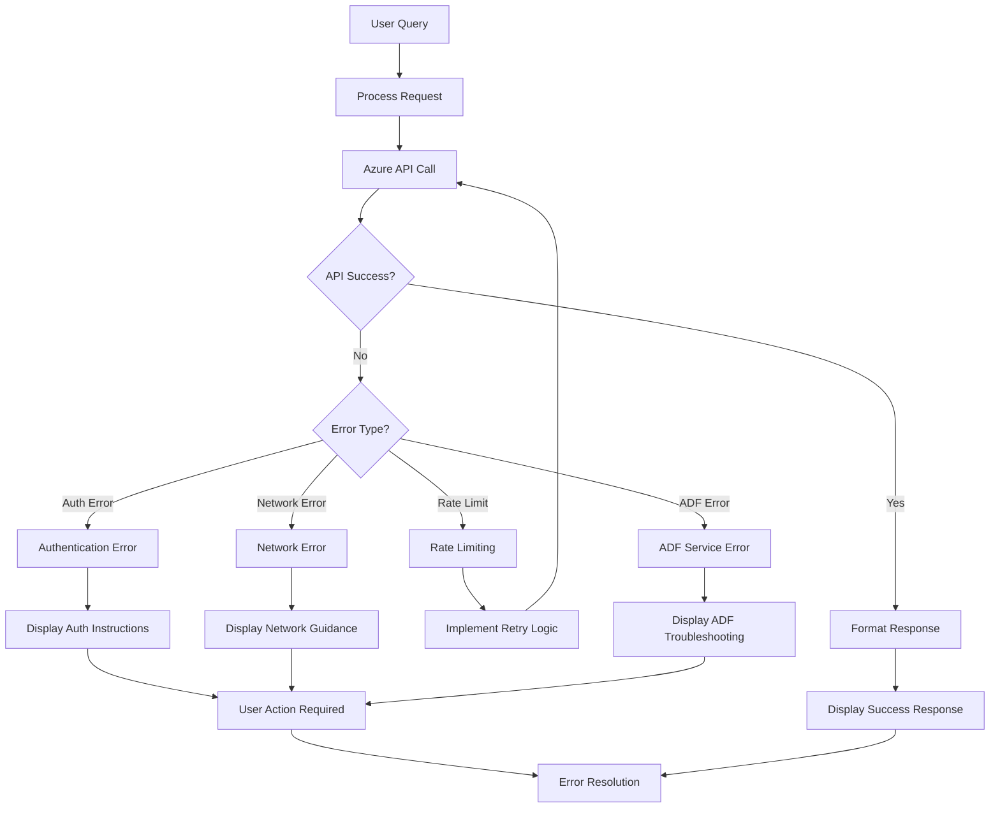
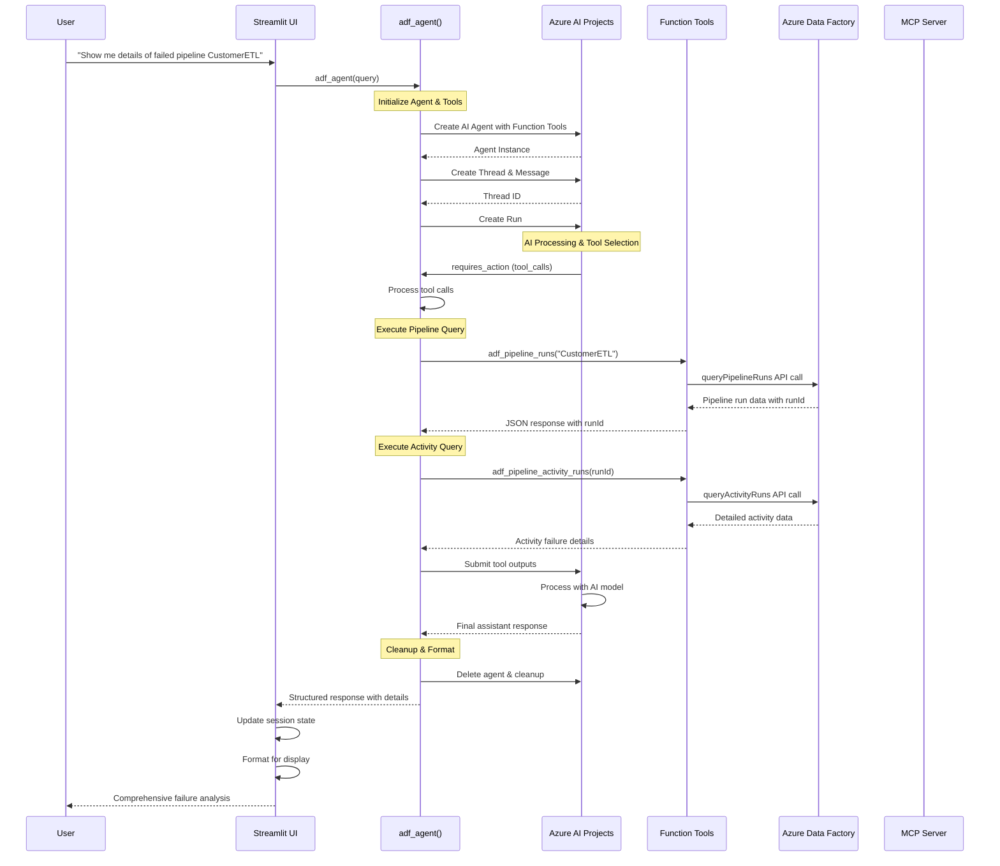
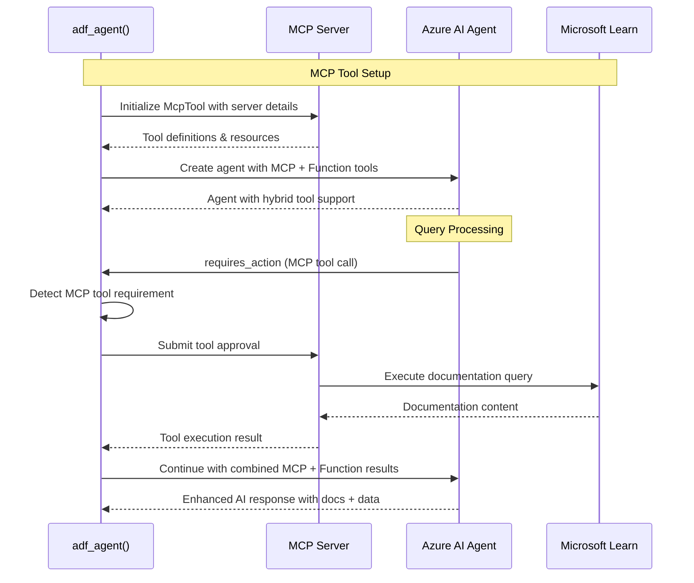

# Azure Data Factory Operations Agent (stadfops.py) - Comprehensive Documentation

## Overview

The Azure Data Factory Operations Agent (`stadfops.py`) is an enterprise-grade, AI-powered assistant specifically designed for production Azure Data Factory monitoring and operations. This operational version extends the base ADF Agent with direct Azure Data Factory API integration, enhanced error handling, and production-ready features for real-time pipeline monitoring.

## Architecture Blueprint

### High-Level Architecture



### Component Architecture

#### 1. Operational Function Tools



#### 2. Enhanced Authentication Flow



## Business Requirements

### Operational Requirements

#### OR-1: Real-Time Pipeline Monitoring
- **Requirement**: Provide real-time visibility into Azure Data Factory pipeline status
- **Implementation**: Direct API integration with 48-hour operational window
- **Business Value**: Reduce MTTR (Mean Time to Resolution) for pipeline issues

#### OR-2: Activity-Level Diagnostics
- **Requirement**: Enable detailed activity-level troubleshooting within pipelines
- **Implementation**: `adf_pipeline_activity_runs()` function with comprehensive error capture
- **Business Value**: Faster root cause analysis and resolution

#### OR-3: Production-Ready Error Handling
- **Requirement**: Robust error handling for enterprise environments
- **Implementation**: Exception wrapping, timeout handling, graceful degradation
- **Business Value**: High availability and reliability for operational teams

#### OR-4: Enhanced Security & Compliance
- **Requirement**: Enterprise-grade security for production environments
- **Implementation**: Managed identity authentication, RBAC compliance
- **Business Value**: Meet enterprise security standards

### Functional Enhancements

#### FE-1: Function Tool Architecture
- **Enhancement**: Replace CodeInterpreterTool with FunctionTool for better control
- **Benefit**: More predictable, secure execution of operational queries
- **Impact**: Improved reliability and auditability

#### FE-2: Extended Time Window Operations
- **Enhancement**: 48-hour operational data window instead of basic queries
- **Benefit**: Better operational visibility and trending
- **Impact**: Improved incident response and analysis capabilities

#### FE-3: Advanced UI Components
- **Enhancement**: Enhanced Streamlit interface with operational focus
- **Benefit**: Better visualization of operational data and debugging information
- **Impact**: Improved user experience for operations teams

## User Flow Diagrams

### Primary Operational Workflow



### Error Handling Flow



## Sequence Diagrams

### Complete Operational Query Sequence



### MCP Integration Sequence



## Use Case Requirements

### UC-OPS-1: Production Pipeline Monitoring

**Scenario**: Operations team needs to monitor critical data pipelines during business hours

**Actors**: 
- Operations Engineer (Primary)
- Data Engineer (Secondary)
- Incident Response Team (Secondary)

**Preconditions**:
- User has Azure Data Factory Reader permissions
- stadfops.py is deployed and configured
- Azure authentication is properly set up

**Main Flow**:
1. **Initial Access**
   - User navigates to stadfops.py dashboard
   - System authenticates with Azure AD
   - Dashboard loads with operational interface

2. **Status Overview Query**
   - User asks: "What's the status of all critical pipelines?"
   - System calls `adf_pipeline_runs()` for each critical pipeline
   - System presents consolidated status dashboard

3. **Drill-Down Investigation**
   - User identifies failed pipeline: "CustomerDataETL"
   - User asks: "Why did CustomerDataETL fail?"
   - System executes two-phase query:
     - Phase 1: Get pipeline run details with `adf_pipeline_runs("CustomerDataETL")`
     - Phase 2: Get activity details with `adf_pipeline_activity_runs(runId)`

4. **Analysis & Response**
   - System provides comprehensive failure analysis
   - User gets actionable insights for resolution
   - System maintains conversation context for follow-ups

**Success Criteria**:
- Complete pipeline status retrieved within 5 seconds
- Activity-level failure details available within 10 seconds
- Clear, actionable error descriptions provided
- Conversation context maintained for iterative investigation

**Alternative Flows**:
- **A1: Authentication Failure**: System provides clear re-authentication instructions
- **A2: API Rate Limiting**: System implements intelligent retry with backoff
- **A3: Network Issues**: System provides graceful degradation and offline guidance

### UC-OPS-2: Historical Trend Analysis

**Scenario**: Data engineering team needs to analyze pipeline performance trends

**Main Flow**:
1. User queries: "Show me the performance trend for CustomerDataETL over the last 48 hours"
2. System retrieves historical run data using extended time windows
3. System analyzes execution patterns, durations, and failure rates
4. System provides trend visualization and insights

**Technical Requirements**:
- 48-hour data retention and query capability
- Performance metrics aggregation
- Trend analysis with AI-powered insights

### UC-OPS-3: Incident Response Workflow

**Scenario**: Critical pipeline failure during peak business hours

**Stakeholders**:
- Incident Commander
- Operations Team
- Development Team
- Business Stakeholders

**Flow**:
1. **Alert Reception**: Incident commander receives pipeline failure alert
2. **Initial Assessment**: Quick status check via stadfops.py
3. **Detailed Investigation**: Activity-level failure analysis
4. **Impact Analysis**: Downstream dependency assessment
5. **Resolution Tracking**: Monitor recovery efforts

**Integration Points**:
- ITSM system integration for ticket creation
- Notification systems for stakeholder updates
- Monitoring dashboards for real-time status

## User Documentation

### Getting Started

#### Prerequisites

1. **Azure Resources**:
   - Azure subscription with appropriate permissions
   - Azure AI Projects workspace
   - Azure OpenAI service deployment
   - Azure Data Factory with data pipelines

2. **Permissions Required**:
   - `Data Factory Contributor` or `Data Factory Reader`
   - `Cognitive Services User` for Azure OpenAI
   - `AI Projects User` for Azure AI Projects

3. **Environment Setup**:
   ```bash
   # Install required dependencies
   pip install -r requirements.txt
   
   # Set up environment variables (see Configuration section)
   export PROJECT_ENDPOINT="https://your-project.services.ai.azure.com/api/projects/your-project"
   export MODEL_DEPLOYMENT_NAME="gpt-4o-mini"
   # ... additional variables
   ```

#### Configuration

Create a `.env` file with the following variables:

```bash
# Azure AI Projects Configuration
PROJECT_ENDPOINT=https://your-account.services.ai.azure.com/api/projects/your-project
MODEL_ENDPOINT=https://your-account.services.ai.azure.com
MODEL_API_KEY=your-api-key
MODEL_DEPLOYMENT_NAME=gpt-4o-mini

# Azure OpenAI Direct Configuration (Alternative)
AZURE_OPENAI_ENDPOINT=https://your-openai.openai.azure.com
AZURE_OPENAI_KEY=your-openai-key

# MCP Server Configuration
MCP_SERVER_URL=https://learn.microsoft.com/api/mcp
MCP_SERVER_LABEL=MicrosoftLearn

# Azure Data Factory Configuration
AZURE_SUBSCRIPTION_ID=your-subscription-id
AZURE_RESOURCE_GROUP=your-resource-group
AZURE_DATA_FACTORY_NAME=your-adf-name
```

#### Running the Application

```bash
# Navigate to the project directory
cd /path/to/deloitte-fy25hack

# Run the Streamlit application
streamlit run stadfops.py

# Alternative: Run with specific configuration
streamlit run stadfops.py --server.port 8501 --server.address 0.0.0.0
```

### User Interface Guide

#### Dashboard Overview

The stadfops.py interface consists of:

1. **Header Section**:
   - Application title: "Azure Data Factory Agent"
   - Clear History button for session management

2. **Main Content Area**:
   - **Left Panel (Summary)**: Displays current query results and token usage metrics
   - **Right Panel (Details)**: Shows comprehensive execution details, tool calls, and debug information

3. **Input Section**:
   - Fixed bottom chat input for natural language queries
   - Real-time processing indicator during agent execution

#### Effective Query Patterns

##### Pipeline Status Queries
```
✓ "What's the status of the CustomerDataETL pipeline?"
✓ "Show me all running pipelines"
✓ "When did the last run of ProcessOrders complete?"
```

##### Troubleshooting Queries
```
✓ "Why did the CustomerDataETL pipeline fail?"
✓ "Show me the error details for pipeline run abc123"
✓ "What activities failed in the last CustomerDataETL run?"
```

##### Operational Queries
```
✓ "How long did the last CustomerDataETL run take?"
✓ "Show me the activity breakdown for the failed run"
✓ "What was the error message for the copy activity?"
```

##### Follow-up Queries
```
✓ "Tell me more about that copy activity error"
✓ "What are the recommended next steps?"
✓ "Has this error occurred before?"
```

### Advanced Features

#### Token Usage Monitoring
- Real-time token consumption tracking
- Cost optimization insights
- Usage pattern analysis

#### Session Management
- Persistent conversation history within session
- Context-aware follow-up questions
- Manual session clearing capability

#### Debug Information
- Comprehensive execution logging
- Tool call traceability
- Azure API response details
- MCP integration status

### Troubleshooting Guide

#### Common Issues

##### Authentication Errors
**Problem**: "Authentication failed" or permission denied errors

**Solutions**:
1. Verify Azure AD authentication:
   ```bash
   az login
   az account show
   ```
2. Check RBAC permissions for Data Factory access
3. Validate environment variables in `.env` file
4. Ensure Managed Identity is properly configured (for production deployments)

##### API Rate Limiting
**Problem**: "Rate limit exceeded" or throttling errors

**Solutions**:
1. Implement request spacing between queries
2. Use caching for repeated queries
3. Monitor Azure Data Factory API quotas
4. Consider upgrading to higher service tiers

##### Network Connectivity
**Problem**: Timeout or connection errors to Azure services

**Solutions**:
1. Verify network connectivity to Azure endpoints
2. Check firewall rules and proxy settings
3. Validate DNS resolution for Azure services
4. Test direct API connectivity using curl/PowerShell

##### Data Factory Specific Errors
**Problem**: "Pipeline not found" or "Invalid pipeline name" errors

**Solutions**:
1. Verify pipeline names are correct and exist
2. Check Data Factory permissions and access
3. Ensure the specified time window contains relevant data
4. Validate resource group and Data Factory name configuration

#### Performance Optimization

##### Response Time Optimization
- Use specific pipeline names instead of broad queries
- Implement query result caching
- Optimize time windows for historical queries
- Use pagination for large result sets

##### Resource Management
- Regular session clearing for long-running sessions
- Monitor Azure resource consumption
- Implement connection pooling for high-volume usage
- Use appropriate Azure service tiers

### Security Best Practices

#### Authentication & Authorization
- Use Managed Identity in production environments
- Implement least-privilege access principles
- Regular audit of user permissions and access patterns
- Secure storage of API keys and secrets

#### Data Privacy
- No persistent storage of pipeline data
- Audit logging for all user interactions
- Compliance with organizational data governance policies
- Regular security assessments and updates

#### Network Security
- Use private endpoints where possible
- Implement network segmentation
- Regular security monitoring and alerting
- Encryption in transit for all communications

This comprehensive documentation provides enterprise-ready guidance for deploying and operating the Azure Data Factory Operations Agent in production environments.