# stadfops.py User Flows & Sequence Diagrams

## Overview

This document provides comprehensive user flow diagrams and sequence diagrams for the Azure Data Factory Operations Agent (`stadfops.py`), detailing the interaction patterns, technical flows, and operational sequences that define the user experience.

## Primary User Flows

### 1. Initial User Onboarding Flow

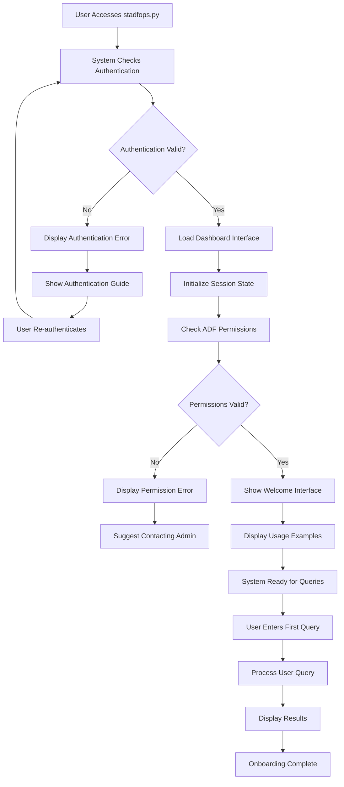

### 2. Operational Monitoring Workflow

```mermaid
flowchart TD
    UserQuery[User Enters Query] --> QueryType{Query Type Analysis}
    
    QueryType -->|Pipeline Status| PipelineFlow[Pipeline Status Flow]
    QueryType -->|Activity Details| ActivityFlow[Activity Details Flow]
    QueryType -->|Historical Analysis| HistoryFlow[Historical Analysis Flow]
    QueryType -->|General Help| HelpFlow[Help & Documentation Flow]
    
    subgraph PipelineFlow [Pipeline Status Workflow]
        P1[Parse Pipeline Name/Pattern]
        P2[Call adf_pipeline_runs Function]
        P3[Query Azure Data Factory API]
        P4[Process Pipeline Status Data]
        P5[Generate AI-Enhanced Response]
        P6[Display Pipeline Status Summary]
        
        P1 --> P2 --> P3 --> P4 --> P5 --> P6
    end
    
    subgraph ActivityFlow [Activity Details Workflow]
        A1[Identify Required Run ID]
        A2[Get Run ID from Pipeline Query]
        A3[Call adf_pipeline_activity_runs Function]
        A4[Query Activity Runs API]
        A5[Analyze Activity Failures]
        A6[Generate Diagnostic Response]
        A7[Display Activity Analysis]
        
        A1 --> A2 --> A3 --> A4 --> A5 --> A6 --> A7
    end
    
    subgraph HistoryFlow [Historical Analysis Workflow]
        H1[Define Time Range]
        H2[Collect Historical Data]
        H3[Perform Trend Analysis]
        H4[Generate Insights]
        H5[Display Trends & Patterns]
        
        H1 --> H2 --> H3 --> H4 --> H5
    end
    
    subgraph HelpFlow [Help & Documentation Workflow]
        Help1[Query MCP Documentation Server]
        Help2[Retrieve Relevant Documentation]
        Help3[Generate Contextual Help]
        Help4[Display Help Information]
        
        Help1 --> Help2 --> Help3 --> Help4
    end
    
    PipelineFlow --> Results[Display Results in UI]
    ActivityFlow --> Results
    HistoryFlow --> Results
    HelpFlow --> Results
    
    Results --> FollowUp{User Follow-up?}
    FollowUp -->|Yes| UserQuery
    FollowUp -->|No| SessionEnd[Session Continues/Ends]
```

### 3. Incident Response Workflow

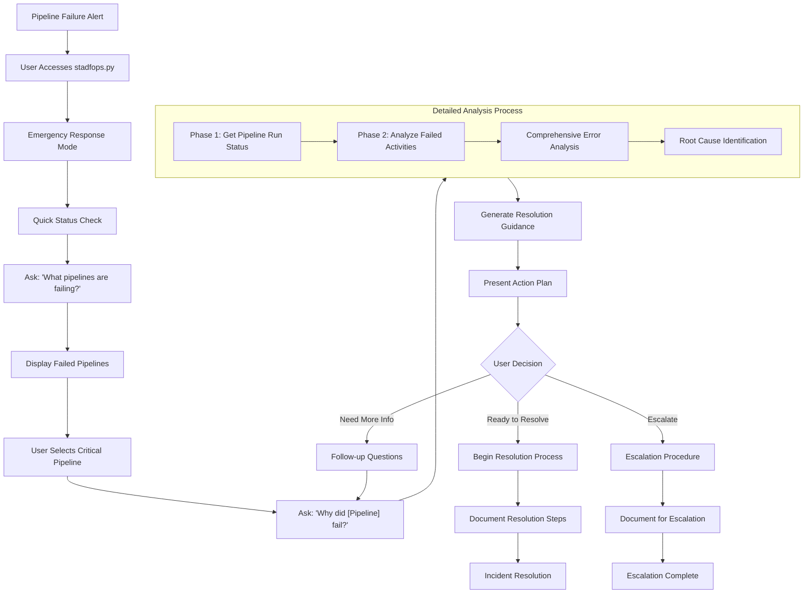

### 4. Self-Service Analytics Workflow

```mermaid
flowchart TD
    AnalyticsRequest[User Requests Analytics] --> RequestType{Analysis Type}
    
    RequestType -->|Performance Analysis| PerfAnalysis[Performance Analysis]
    RequestType -->|Trend Analysis| TrendAnalysis[Trend Analysis]
    RequestType -->|Compliance Report| ComplianceReport[Compliance Reporting]
    RequestType -->|Cost Analysis| CostAnalysis[Cost Analysis]
    
    subgraph PerfAnalysis [Performance Analysis Flow]
        PA1[Define Performance Metrics]
        PA2[Collect Execution Data]
        PA3[Calculate Performance KPIs]
        PA4[Identify Performance Issues]
        PA5[Generate Optimization Recommendations]
        
        PA1 --> PA2 --> PA3 --> PA4 --> PA5
    end
    
    subgraph TrendAnalysis [Trend Analysis Flow]
        TA1[Define Analysis Period]
        TA2[Collect Historical Data]
        TA3[Perform Statistical Analysis]
        TA4[Identify Patterns & Anomalies]
        TA5[Generate Predictive Insights]
        
        TA1 --> TA2 --> TA3 --> TA4 --> TA5
    end
    
    subgraph ComplianceReport [Compliance Reporting Flow]
        CR1[Define Compliance Requirements]
        CR2[Collect Audit Data]
        CR3[Validate Against Standards]
        CR4[Generate Compliance Report]
        CR5[Export for Audit]
        
        CR1 --> CR2 --> CR3 --> CR4 --> CR5
    end
    
    PerfAnalysis --> DisplayResults[Display Analysis Results]
    TrendAnalysis --> DisplayResults
    ComplianceReport --> DisplayResults
    CostAnalysis --> DisplayResults
    
    DisplayResults --> ExportOptions[Provide Export Options]
    ExportOptions --> ShareResults[Share with Stakeholders]
```

## Technical Sequence Diagrams

### 1. Complete Query Processing Sequence

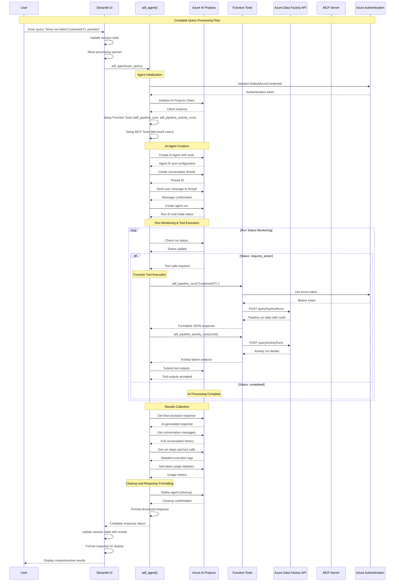

### 2. Error Handling Sequence

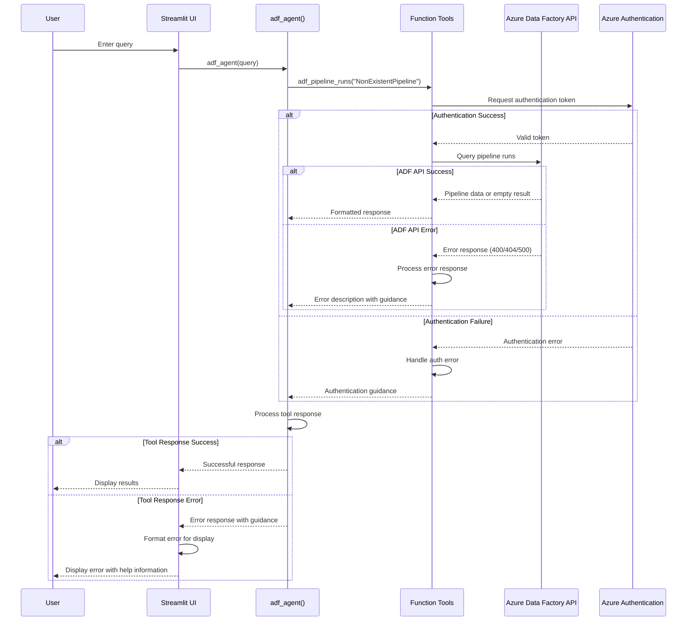

### 3. Multi-Tool Orchestration Sequence

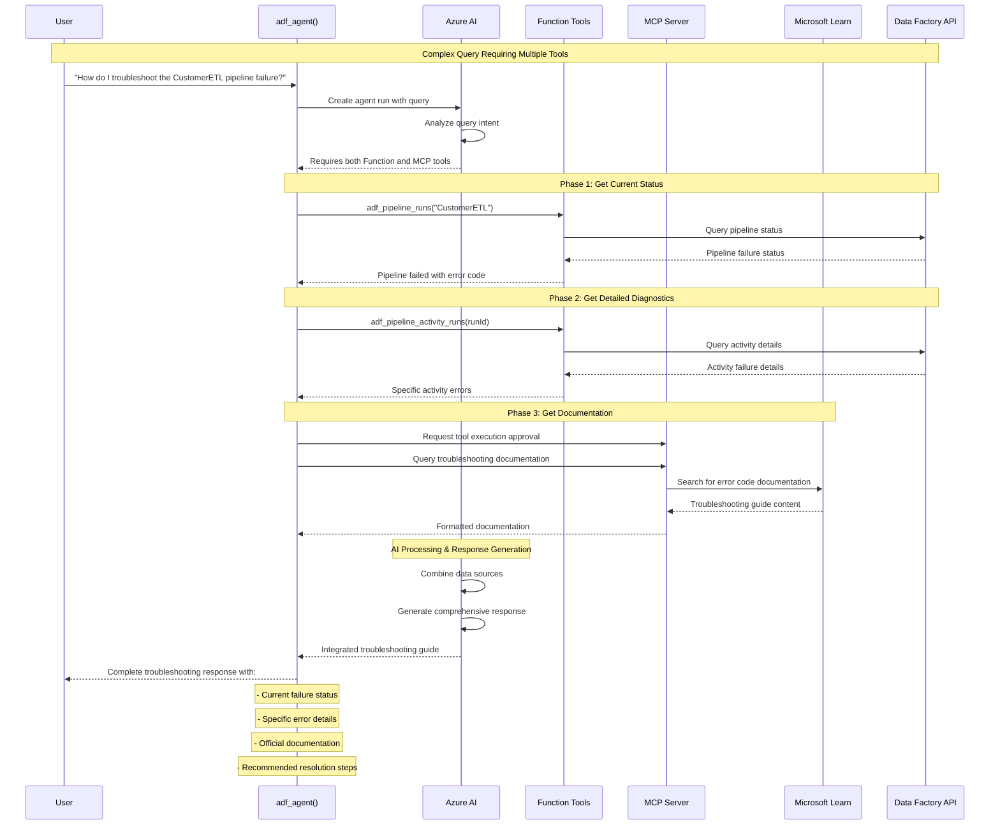

### 4. Session State Management Sequence

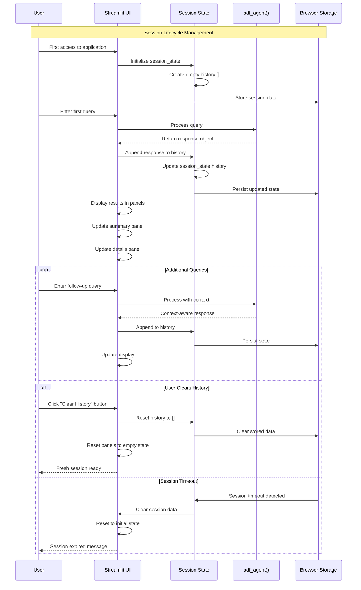

### 5. Real-Time Monitoring Sequence

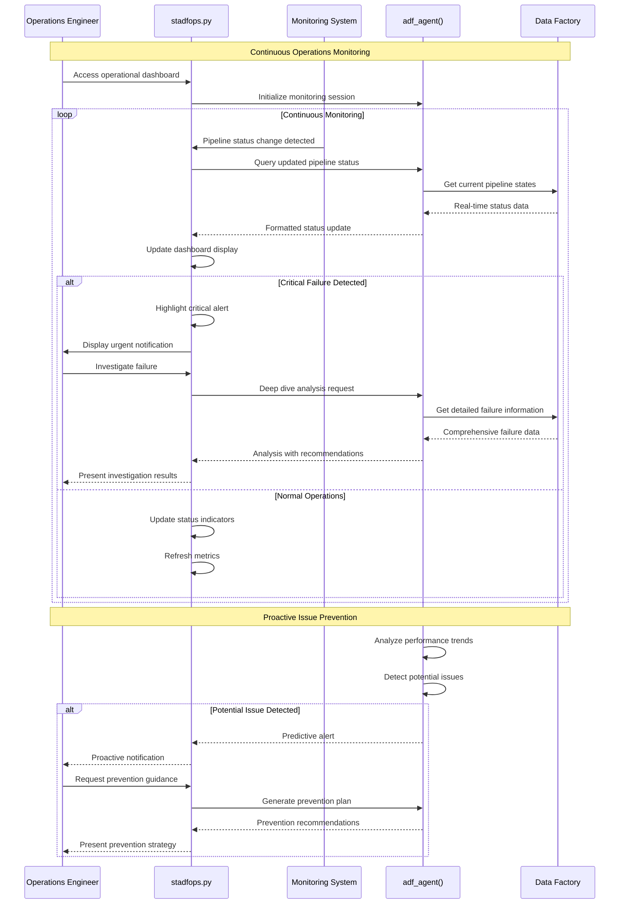

## User Experience Patterns

### 1. Progressive Disclosure Pattern

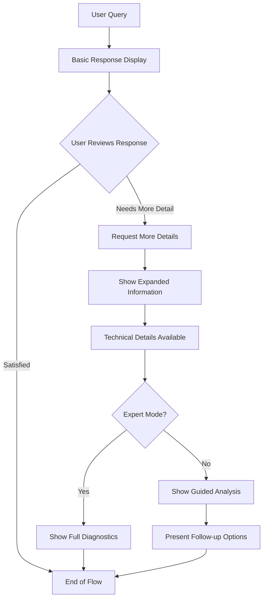

### 2. Context-Aware Assistance Pattern

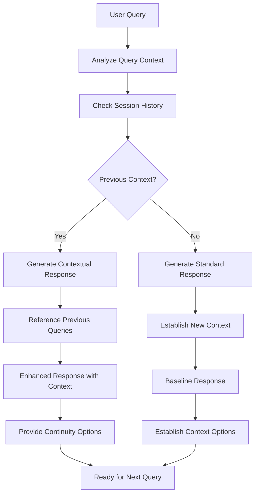

### 3. Error Recovery Pattern

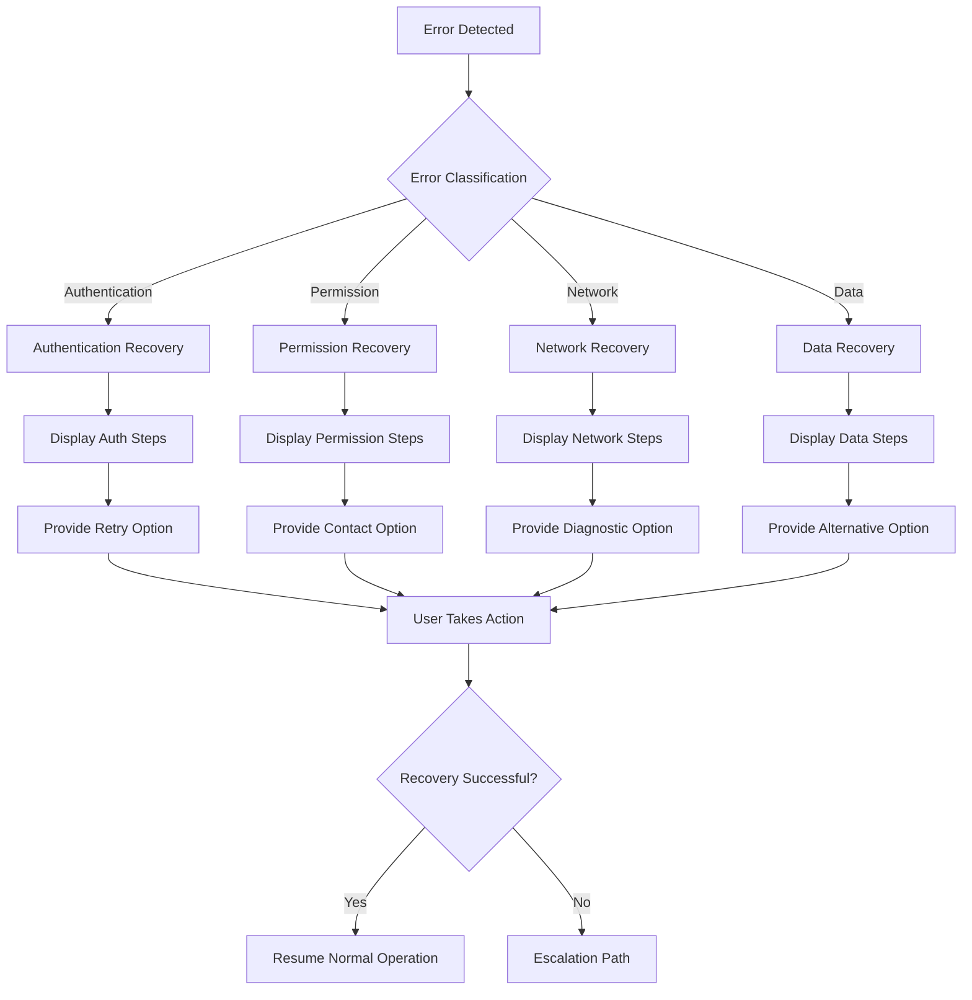

These comprehensive user flows and sequence diagrams provide a detailed blueprint for understanding how users interact with the Azure Data Factory Operations Agent and how the system processes and responds to operational requirements.