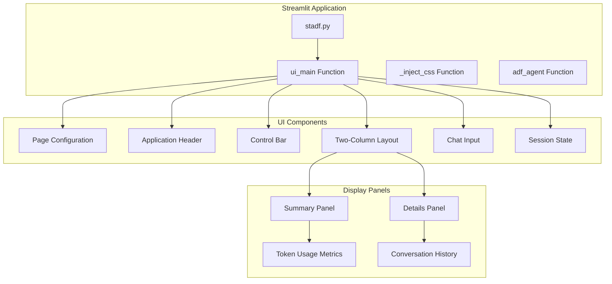
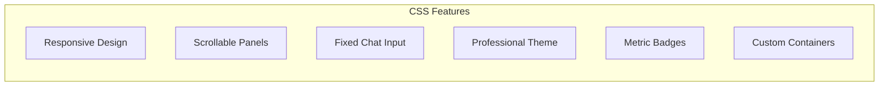
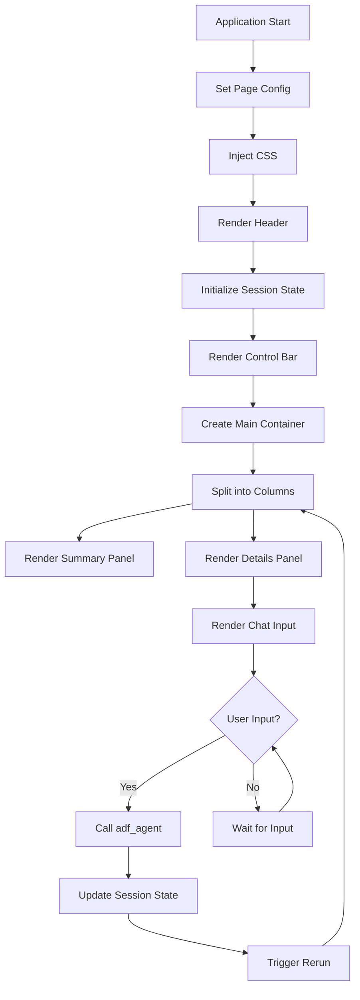
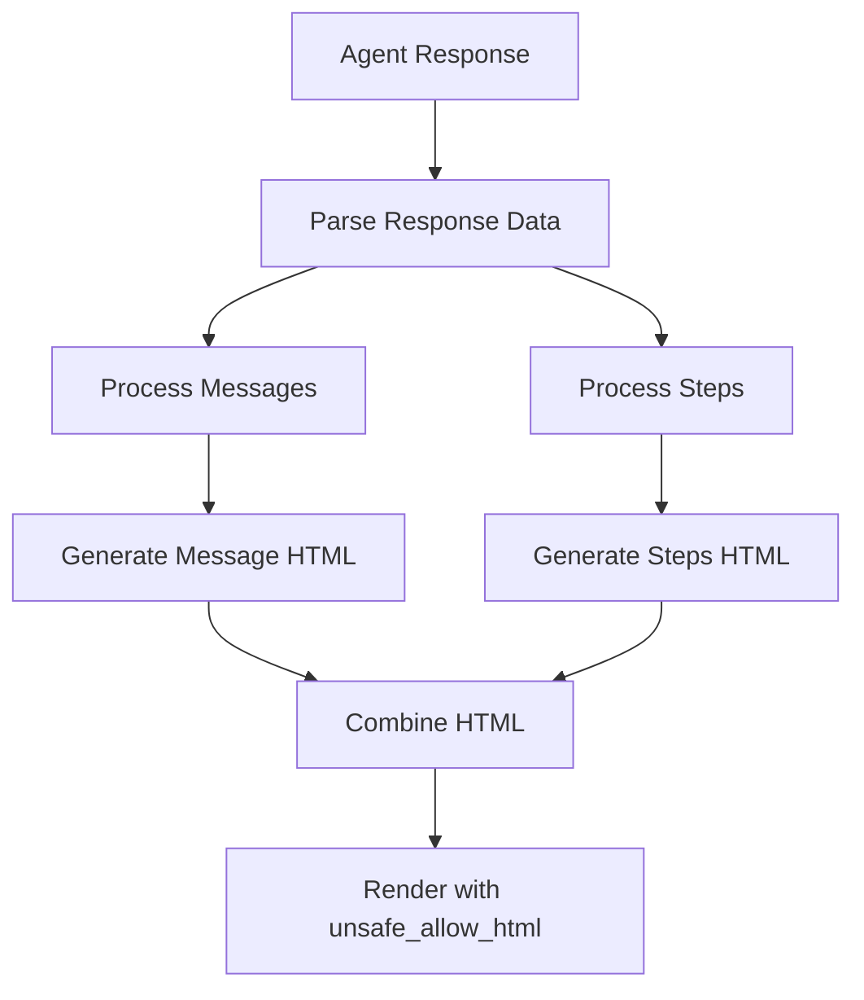
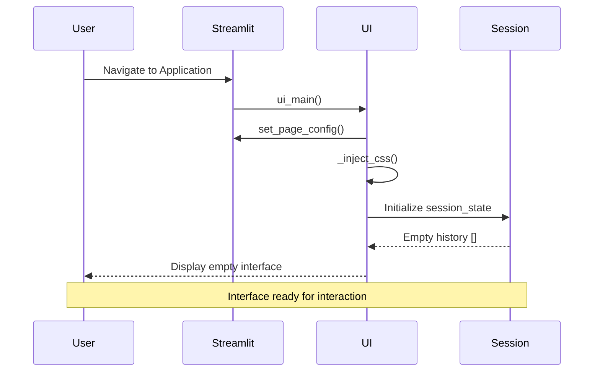
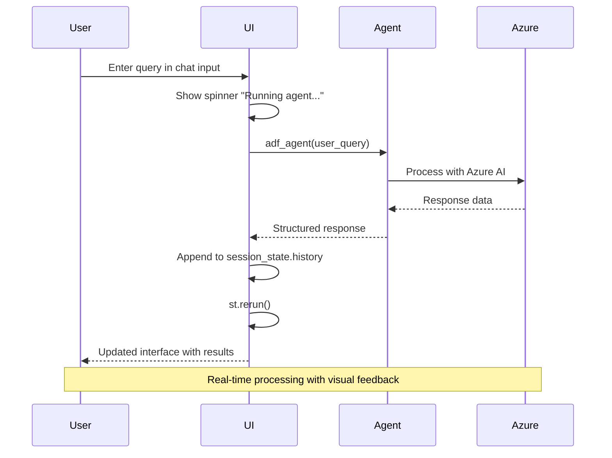
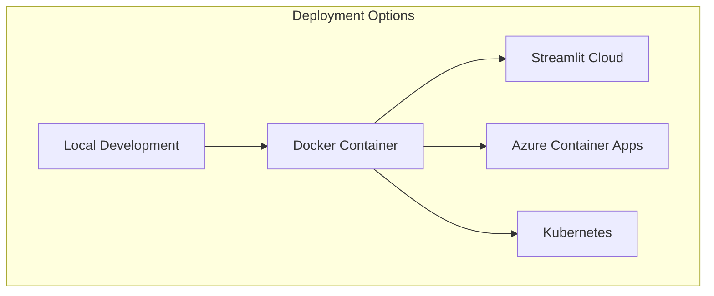

# Streamlit Implementation Documentation

## Overview

The Streamlit implementation (`stadf.py`) provides a professional, dashboard-style interface for the Azure Data Factory Agent. This implementation focuses on providing a clean, structured layout optimized for data monitoring and analysis workflows.

## Architecture

### Component Structure



## Key Features

### 1. Professional Dashboard Layout

The Streamlit interface provides a split-panel view optimized for professional use:

- **Left Panel**: Summarized responses and token usage metrics
- **Right Panel**: Detailed conversation history and execution steps
- **Fixed Input**: Chat input fixed at the bottom for consistent access

### 2. Advanced CSS Styling



**Key Styling Elements:**
- Custom scrollable containers with webkit scrollbar styling
- Professional color scheme with subtle shadows and borders
- Fixed-position chat input with elevated styling
- Responsive metric badges for token usage display
- Monospace font for detailed technical information

### 3. Session State Management

```python
# Session state structure
if "history" not in st.session_state:
    st.session_state.history = []

# History item structure
{
    "summary": "Assistant response text",
    "details": "Detailed execution log",
    "messages": [{"role": "user|assistant", "content": "..."}],
    "steps": [{"id": "...", "status": "...", "tool_calls": [...]}],
    "token_usage": {"prompt_tokens": 123, "completion_tokens": 456},
    "status": "completed|failed|..."
}
```

## Implementation Details

### Core Functions

#### 1. `ui_main()` - Main UI Function



**Key Implementation Details:**

```python
def ui_main():
    st.set_page_config(page_title="ADF Agent", layout="wide")
    _inject_css()
    st.markdown("### Azure Data Factory Agent")
    
    # Session state initialization
    if "history" not in st.session_state:
        st.session_state.history = []
    
    # Control bar with clear functionality
    bar_col1, bar_col2 = st.columns([0.8, 0.2])
    with bar_col2:
        if st.button("Clear History", use_container_width=True):
            st.session_state.history = []
            st.rerun()
    
    # Main container with fixed height
    container = st.container(height=600)
    with container:
        col1, col2 = st.columns(2, gap="medium")
        latest = st.session_state.history[-1] if st.session_state.history else None
        
        # Summary panel (left)
        with col1:
            st.markdown("**Summary**")
            if latest:
                st.markdown(f"<div class='summary-box'>{latest['summary']}</div>", 
                          unsafe_allow_html=True)
                # Token usage badges
                if latest.get("token_usage"):
                    tu = latest["token_usage"]
                    badges = "".join(f"<span class='metric-badge'>{k}: {v}</span>" 
                                   for k, v in tu.items())
                    st.markdown(badges, unsafe_allow_html=True)
        
        # Details panel (right)
        with col2:
            st.markdown("**Details**")
            if latest:
                # Render conversation and steps
                # ... (detailed HTML rendering)
    
    # Fixed chat input
    user_query = st.chat_input("Ask about Azure Data Factory job status...")
    if user_query:
        with st.spinner("Running agent...", show_time=True):
            result = adf_agent(user_query)
        st.session_state.history.append(result)
        st.rerun()
```

#### 2. `_inject_css()` - Custom Styling

**Critical CSS Classes:**

```css
/* Main container styling */
.summary-box, .details-box {
    border: 1px solid #d9dde2;
    border-radius: 8px;
    background: #ffffff;
    box-shadow: 0 1px 2px rgba(0,0,0,0.04);
    height: 520px;
    overflow-y: auto;
    padding: 0.75rem;
}

/* Fixed chat input */
.stChatInput {
    position: fixed;
    bottom: 0;
    left: 0;
    right: 0;
    z-index: 1000;
    background: #ffffff;
    padding: 0.4rem 0.75rem;
    border-top: 1px solid #d0d4d9;
    box-shadow: 0 -2px 4px rgba(0,0,0,0.06);
}

/* Metric badges */
.metric-badge {
    display: inline-block;
    background: #eef2f6;
    color: #222;
    padding: 4px 8px;
    margin: 2px 4px 4px 0;
    border-radius: 6px;
    font-size: 0.65rem;
    border: 1px solid #d0d5da;
}
```

#### 3. Response Rendering System

The Streamlit implementation uses a sophisticated HTML rendering system for displaying detailed information:



**Message Rendering:**
```python
msg_html_parts = ["<div><strong>Conversation</strong><br>"]
for m in latest.get("messages", []):
    role = m.get('role','?').title()
    content = (m.get('content') or '').replace('<','&lt;').replace('>','&gt;')
    msg_html_parts.append(
        f"<div style='margin-bottom:4px;'>"
        f"<span style='color:#555;'>{role}:</span> {content}"
        f"</div>"
    )
```

**Steps and Tool Calls Rendering:**
```python
steps_html_parts = ["<div style='margin-top:0.75rem;'><strong>Steps & Tool Calls</strong><br>"]
for s in latest.get("steps", []):
    steps_html_parts.append(
        f"<div style='margin:4px 0; padding:4px 6px; "
        f"background:#fafbfc; border:1px solid #e2e6ea; border-radius:4px;'>"
        f"<div style='font-size:0.65rem; letter-spacing:0.5px; color:#333;'>"
        f"<strong>Step {s['id']}</strong> • {s['status']}</div>"
    )
    
    # Render tool calls
    if s.get('tool_calls'):
        for tc in s['tool_calls']:
            # Render individual tool call details
```

## User Experience Flow

### Initial Load Experience



### Query Processing Experience



## Advantages of Streamlit Implementation

### 1. **Professional Dashboard Feel**
- Clean, structured layout ideal for business users
- Persistent sidebar and navigation elements
- Professional color scheme and typography

### 2. **Advanced State Management**
- Built-in session state handling
- Automatic state persistence across interactions
- Easy history management and clearing

### 3. **Rich HTML Rendering**
- Custom HTML for detailed information display
- Flexible styling with CSS injection
- Professional metric badges and indicators

### 4. **Responsive Design**
- Mobile-friendly responsive layout
- Scalable components and containers
- Optimized for various screen sizes

### 5. **Performance Optimizations**
- Efficient rerun handling
- Lazy loading of complex HTML
- Optimized scrolling containers

## Configuration & Customization

### Environment Variables

```python
# Required environment variables
endpoint = os.environ["PROJECT_ENDPOINT"]
model_endpoint = os.environ["MODEL_ENDPOINT"]
model_api_key = os.environ["MODEL_API_KEY"]
model_deployment_name = os.environ["MODEL_DEPLOYMENT_NAME"]

# Optional MCP configuration
mcp_server_url = os.environ.get("MCP_SERVER_URL", "https://learn.microsoft.com/api/mcp")
mcp_server_label = os.environ.get("MCP_SERVER_LABEL", "MicrosoftLearn")
```

### Customization Options

1. **Theme Customization**
   - Modify `_inject_css()` for custom branding
   - Adjust color schemes and typography
   - Custom component styling

2. **Layout Modifications**
   - Adjust column ratios in `st.columns()`
   - Modify container heights and sizing
   - Add additional panels or sections

3. **Feature Extensions**
   - Add new session state variables
   - Implement additional control buttons
   - Extend response rendering formats

## Deployment Considerations

### Production Deployment



### Performance Tuning

1. **Memory Management**
   - Regular session state cleanup
   - Efficient HTML string handling
   - Optimized CSS loading

2. **Response Time Optimization**
   - Caching frequently used data
   - Async processing where possible
   - Efficient Azure API calls

3. **Scalability Considerations**
   - Stateless design for horizontal scaling
   - External session storage for multi-instance deployments
   - Load balancing compatibility

## Troubleshooting

### Common Issues

1. **CSS Not Loading**
   - Verify `_inject_css()` is called
   - Check for CSS syntax errors
   - Clear browser cache

2. **Session State Issues**
   - Ensure proper session state initialization
   - Check for state key naming conflicts
   - Verify rerun triggers

3. **HTML Rendering Problems**
   - Validate HTML syntax in render functions
   - Check for proper string escaping
   - Verify `unsafe_allow_html=True` usage

### Debug Mode

Enable Streamlit debug mode for development:

```bash
streamlit run stadf.py --logger.level=debug
```

This comprehensive Streamlit implementation provides a robust, professional interface for Azure Data Factory operations with advanced features for enterprise use.