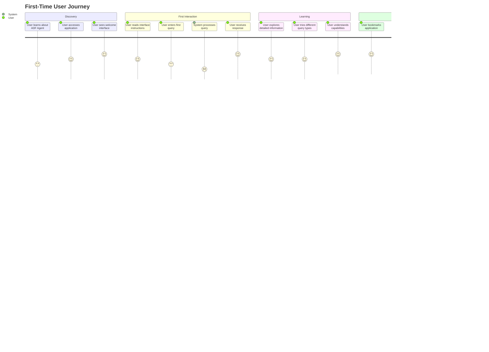

# User Interaction Flows

## Overview

This document details the user interaction flows for both Streamlit and Gradio implementations of the Azure Data Factory Agent, including Mermaid diagrams showing user journeys, system interactions, and MCP integration patterns.

## Common User Flows

### 1. First-Time User Onboarding

### 2. Daily Usage Pattern

## Streamlit-Specific User Flows

### 1. Professional Dashboard Workflow

### 2. Multi-Panel Information Flow

## Gradio-Specific User Flows

### 1. Conversational Chat Experience

### 2. Real-time Response Formatting

## MCP Integration User Flows

### 1. Tool Discovery and Execution

### 2. Multi-Tool Workflow

## Error Handling Flows

### 1. Agent Failure Recovery

### 2. MCP Tool Failure Handling

## Performance and Scalability Flows

### 1. Concurrent User Management

### 2. Response Caching Strategy

## Mobile and Accessibility Flows

### 1. Mobile User Experience

### 2. Accessibility Compliance Flow

## Integration Testing Flows

### 1. End-to-End Testing Scenario

This comprehensive user flow documentation provides detailed insights into how users interact with both implementations of the Azure Data Factory Agent, including the sophisticated MCP integration patterns and real-world usage scenarios.